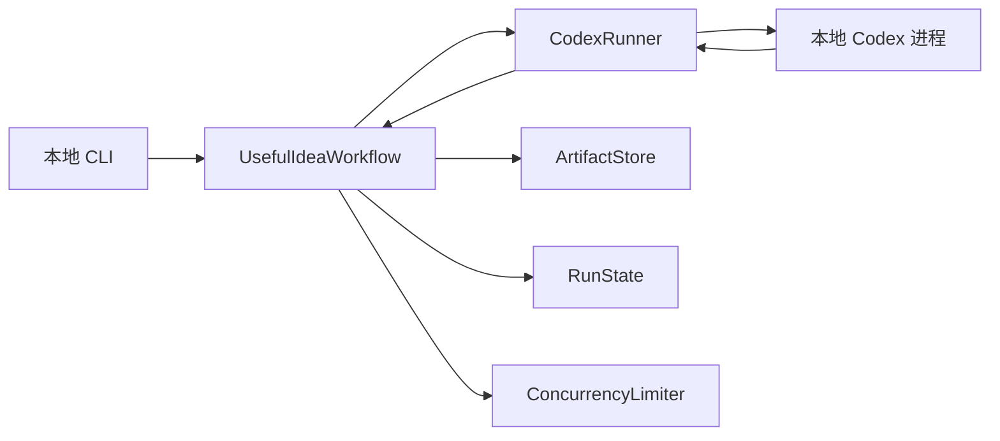

# Useful Idea Orchestration v1：技术设计草案

> 状态：规划中。本文只定义已确认的系统边界；尚未确认的技术选择会明确标记，不视为最终决定。

## 1. 本版要完成什么

给定一个黑客松题目或 Initial Prompt，在本地运行一条可恢复、可检查的 Useful Idea 工作流，最终产出：

- 相关职业、人群和类型列表
- 带来源、判断状态和淘汰原因的问题卡
- 经过竞品检查的 Idea Cards
- 完整运行记录

本版结束于 Idea Card，不进入 Build、Pitch 或 Creative 路线。

## 2. 设计原则

1. **先做纵向闭环。** 底座必须立即服务于 Useful Idea 的真实阶段，不单独建设一个空泛的 Agent 平台。
2. **先具体，后抽象。** v1 只有 Codex Runner；未来真正加入 Claude Code 后，再从两种运行时的实际差异中提取 Provider 抽象。
3. **编排写在代码里。** 阶段、输入输出、重试和门槛是显式状态，不依赖一个 Agent 在超长 Prompt 中自行记住全部流程。
4. **内容由 Agent 判断，控制由程序负责。** Agent 负责研究、归纳和提出方案；程序负责并发上限、状态推进、Schema 校验、失败恢复和产物落盘。
5. **只淘汰，不过度收敛。** 系统允许每个阶段得到可变数量的合格结果，不内置 Top-K 或固定配额。

## 3. 最小结构

### `UsefulIdeaWorkflow`

负责按已确认的方法推进阶段：

1. 解析题目与硬约束
2. 扩散职业、人群和类型
3. 按人群并行寻找真实问题材料
4. 独立复核来源是否支持问题主张
5. 生成并校验问题卡
6. 对证据不足的问题追加一次搜索
7. 使用绝对门槛判断通过或淘汰
8. 从每个过线问题展开一个或多个 Idea
9. 搜索已有产品和竞品
10. 修改、合并或淘汰 Idea
11. 输出最终 Idea Cards 与过程记录

工作流决定“下一步做什么”，但不决定最终必须剩下多少项。

### `CodexRunner`

这是 v1 唯一的模型执行适配层，负责：

- 启动一次 Codex 任务
- 传入阶段 Prompt、上下文和结构化输出要求
- 持续读取运行事件
- 返回标准化的成功结果或失败信息
- 保存 Codex 会话标识，以便中断后继续
- 取消超时或已经失去价值的任务

它只封装 Codex 的真实能力，不先实现虚构的通用 Provider 接口。

v1 已确认采用 Python + `asyncio` 管理本地 `codex exec` 子进程：

- Prompt 通过标准输入传入，避免受到命令行长度和转义影响。
- 使用 `--json` 持续读取 JSONL 事件，并把 stdout 与 stderr 分开保存。
- 每个阶段通过 `--output-schema` 要求最终结果符合对应 JSON Schema。
- 从事件中保存 session id；运行中断后使用 `codex exec resume <SESSION_ID>` 尽量续接原任务。
- 并行度由 `asyncio.Semaphore` 控制；每个子进程仍有独立的超时、取消、退出码和日志。
- 不使用 `shell=True` 拼接命令；Runner 以参数列表启动进程，避免 Prompt 被 shell 解释。

这个选择继承 ClaudeHack 已经跑通的“Python 确定性控制面 + CLI Agent 子进程”结构，同时利用 Codex 的结构化事件和输出 Schema。v1 不改用 TypeScript SDK，也不依赖 beta Python SDK。

### `ArtifactStore`

使用本地文件保存每次运行的输入、中间证据、共享工作文档和日志。v1 不需要数据库，也不要求把一个自然文档包装成复杂的 artifact package。

它管理两类不同文件：

- **账本型文件**：原始题目、Evidence、Decision、Elimination 和运行事件。这些内容追加或产生新版本，不能静默覆盖。
- **Living Documents**：Problem、Idea、后续 PRD 和 Pitch 等可以由多个 Agent 持续发展的 Markdown 文件。第一次由一个 Agent 创建，后续 Agent 读取同一路径并修改正文。

Evidence 不要求先混成一个总文件。S2 中每个 Research Agent 创建一份独立、完成后不可改写的研究文档；后续 Agent 通过文档路径和局部证据编号引用它。只有多个 Agent 同时发展同一份 Living Document 时才需要 Editor 汇合。

结构化 JSON/JSONL 用于程序必须稳定判断的状态与引用；Markdown 用于本来就需要被反复阅读和编辑的文档。共享文档的修改历史由运行记录或版本快照保存，不要求文档正文携带一层 package envelope。

Living Document 的并行写入协议为：

1. Orchestrator 固定当前共享文件的 base revision。
2. 多个并行 Agent 都读取这一版正文，各自返回修改建议或 patch，不直接写 canonical 文件。
3. 一个 Editor Agent 读取 base revision 和全部修改建议，处理冲突、重复与互补内容。
4. Editor 只写回一次新的 canonical revision，并记录采用、合并或拒绝了哪些建议。
5. 下一轮 Agent 统一读取新的 revision。

若一个阶段只有单个 Agent，允许它直接更新 Living Document；“单一 Editor”规则只用于同一轮存在多个并行修改者的情况。

### `RunState`

至少记录：

- `run_id`
- 当前阶段
- 当前状态：等待、运行、完成、失败、已取消
- 每个任务对应的 Codex 会话标识
- 尝试次数与最近失败原因
- 已完成产物的位置
- 下一步可执行动作

### Challenge Brief 的两个读取视图

S0 保存一份完整、不可静默覆盖的 `ChallengeBrief`，但后续 Agent 不默认读取全部字段。控制器从同一份事实生成两个视图：

- `DiscoveryView`：主题、要解决的领域、题目明确指定的人群以及与需求研究直接相关的非技术边界。Audience、Research、Problem 和首轮 Idea Agent 只读这个视图。
- `ComplianceView`：强制技术、Sponsor 要求、提交格式、时间限制、交付物和其他合规条件。只有 Idea 草案形成后的技术检查读取。

这样落实“先找问题，再检查技术”，同时不复制出两套可能漂移的 Challenge 真相；两个视图都从同一份 Brief 生成。

### `ConcurrencyLimiter`

只控制同一时间运行多少个 Codex 任务，避免本机资源失控。它不限制候选总数，也不负责把结果筛成固定数量。

## 4. 产物契约

v1 至少定义五类可校验产物：

1. `AudienceList`：只含职业、人群或类型及其与题目的关系，不含臆想场景。
2. `ProblemCard`：人群、真实场景、问题、用户原话或直接描述、来源、替代办法、假设、状态与判断依据。
3. `IdeaCard`：使用者、具体问题、完整使用过程、核心功能、现有办法为何不足、技术的真实作用、引用的问题卡。
4. `EliminationRecord`：被淘汰对象、发生阶段、触发的门槛、证据和原因。
5. `EvidenceRecord`：位于独立研究文档中的证据条目，包含文档内局部 id、平台、URL、日期、原文摘录、上下文、关联人群和 Research Agent 的暂定主张。跨文档稳定引用使用“文件路径 + 局部 id”；后续复核结果另存并引用它，不回写原研究文档。

准确字段和保存格式将在实现规划中确定。Schema 校验失败属于可重试的执行失败，不等同于内容未通过质量门槛。

## 5. 失败与恢复

- 单个并行任务失败时，不让整次运行立即作废；记录失败并按预算重试。
- 内容证据不足按照 Useful 方法额外搜索一次；这是研究流程，不与基础设施重试混在一起。
- 程序中断后，根据本地状态跳过已经完成且校验通过的阶段，并尽量继续原 Codex 会话。
- 一旦达到稍后定义的时间、费用或重试预算，停止新增任务，保留所有已有产物并清楚标记未完成项。
- 合并、淘汰和修改都要留下记录，不能静默覆盖旧结论。

## 6. 明确不在 v1 中建设的部分

- Claude Code 适配
- 通用多模型 Provider 接口
- 通用 Workflow DSL 或可视化工作流编辑器
- 数据库、Web 控制台或远程队列
- Docker、VM 或分布式执行
- Build、Pitch 和 Creative 路线

## 7. 当前待确认的技术选择

1. 哪些阶段输出采用 JSON/JSONL 账本，哪些直接采用共享 Markdown 文档。
2. 默认并发数、阶段超时、重试次数和整次运行预算。
3. 第一版 CLI 的输入方式、进度显示和恢复命令。

## 8. 已确认的研究方式

- Research Agent 通过 Codex 原生网页搜索收集材料。
- Prompt 明确优先 GitHub Issues/Discussions 与 Reddit 的自然讨论，但根据人群选择更合适的平台，不设置平台配额。
- 搜索阶段保留原始 URL、日期、摘录和上下文，不只输出综合结论。
- Evidence Verifier 使用独立 Codex 任务重新访问来源，不继承 Research Agent 的结论上下文，防止同一个 Agent 自证。
- v0.1 不开发独立爬虫、搜索索引或长期监听系统。只有真实运行证明原生搜索在覆盖率、可访问性或可复现性上不足时，后续版本才增加相应基础设施。

## 9. v0.1 验证方式

- 选定一道有原始题目、规则和技术要求的真实黑客松题目作为 benchmark。
- 用同一份原始输入完整运行 Audience → Research → Evidence Verification → Problem Gate → Idea → Competitor Check。
- 首版只要求这一个 benchmark 能够完整运行、保留证据并产出可人工评审的 Idea Cards；不把跨赛题泛化作为完成条件。
- 输入格式和阶段契约仍保持通用，禁止把 benchmark 的具体答案或特定人群硬编码进 Prompt。
- 真实运行暴露的问题按“来源覆盖不足、证据误判、问题误杀、问题误放、Idea 重复、Idea 不完整、运行故障”记录，作为 v0.2 的改动依据。
