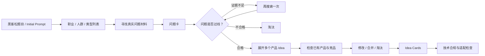

# Useful 路线：Idea 生成方法

> 状态：本轮讨论已确认的 v1 方案。问题门槛属于初始假设，需要在真实运行中校准。

## 1. 目标与边界

输入一个黑客松题目或 Initial Prompt，输出数量可变、具有真实问题依据、能够发展为端到端产品的 Idea Cards。

本章节只讨论 `Useful` 路线，结束于 Idea Card，不讨论后续 PRD、Build、Pitch 或 Agent 调度。`Creative` 路线以后单独讨论。ClaudeHack 被视为已经验证有效的基础，新版继承其有效方法并增加当前确认的新要求，而不是以纠正 ClaudeHack 为出发点。

## 2. 核心原则

1. **先找原料，再想产品。** 不直接要求模型凭空脑暴一批产品名。
2. **只从问题出发。** 黑客松指定技术不是 Useful Idea 的起点；产品方向形成后才检查技术是否适用或是否为比赛硬性要求。
3. **只淘汰，不按名额筛选。** 不做 Top-K；通过统一质量门槛的 Idea 全部保留，最终数量可变。
4. **不强制方向差异。** 两个相似 Idea 只要都成立，就都可以继续。
5. **目标是产品，不是前端样品。** Idea 至少要能形成一条使用真实输入、经过真实处理并产生可用结果或动作的完整流程。
6. **先独立思考，再看竞品。** 避免一开始被已有产品锚定，同时也避免闭门造车。

## 3. 总体流程

## 4. 第一步：扩散相关人群

第一版先由一个 Agent 根据题目扩散出可能相关的职业、人群或类型，再分别从这些人群出发寻找真实问题。

这一阶段不要求 Agent 同时给出具体做事场景。初始描述可以停留在“老师”“学生”“独立开发者”“新手父母”这样的层级，只要它代表一个与题目相关、可以继续研究的人群即可。

“每周需要为不同水平学生准备练习题的初中老师”这类具体场景不能在这里预先生成，因为它可能只是 Agent 的臆想。场景和更细的人群划分必须在下一步从真实问题材料中发现。

### 人群扩散规则

- 由一个 Agent 负责从题目扩散出相关职业、人群和类型，不只列出题目中最明显的最终用户。
- 只描述人群本身，不为每个人群编写未经研究的任务、痛点或场景。
- 不向与题目没有直接关系的人群无限扩展。
- 后续问题研究发现真实的场景或更精确的子人群时，再把它补充到记录中。
- 某个人群持续找不到真实问题证据时，停止在该人群上投入。

## 5. 第二步：寻找真实问题材料

从上一步得到的每个人群出发，寻找他们实际遇到的问题。问题、发生场景和更细的人群描述必须来自可追溯的外部材料或用户提供的研究资产，而不是 Agent 编造。可用材料包括论坛帖子、产品评价、社区讨论、GitHub Issues、求助内容以及用户已有的访谈、工单或研究记录。

这里吸收 customer-voice 研究方法：保存用户原话、发生背景、来源和当前替代办法，使后续 Agent 能区分“真实存在”与“听起来合理”。

### 优先搜索 GitHub 与 Reddit

v1 的 Research Prompt 应明确鼓励 Agent 优先寻找 GitHub 和 Reddit 上的自然用户材料，而不只搜索经过包装的产品介绍和 SEO 文章。

- **GitHub Issues / Discussions**：寻找 bug、feature request、反复出现的工作流摩擦、用户写出的手工 workaround，以及维护者为什么拒绝或无法解决某个需求。
- **Reddit 帖子 / 评论**：寻找“你们怎么处理 X”“有没有能做 X 的工具”“我受够了 X”“我从 A 换到 B”等自然问题表达，同时阅读评论中的替代办法、反例和认同程度。
- **搜索词优先来自人群自己的语言**：例如角色名、任务名、抱怨用词、`how do you`、`looking for`、`alternative`、`workaround`、`feature request`，而不是只搜索 Agent 已经想好的产品概念。
- **平台是优先入口，不是硬性配额**：开发者或技术工作流应重点使用 GitHub；非技术人群则可以更多使用 Reddit、App Store 评论、专业论坛、产品评价站或其他更自然的讨论场所。找不到相关材料时不得用无关的 GitHub 结果凑数。

### 独立证据复核

Research Agent 找到材料后，另一名 Evidence Verifier 必须重新打开每条来源，检查：

1. 链接是否真实存在且能够访问。
2. 保存的用户原话是否与原文一致。
3. 原文中的人是否确实属于所声明的人群。
4. 来源是否真的支持所声明的问题、场景和替代办法。
5. Agent 是否把单个极端案例夸大成普遍问题。

复核结果为 `支持`、`部分支持`、`不支持` 或 `无法访问`。Research Agent 不能复核自己的结论；只有通过复核的证据才能支撑问题卡进入下一道门槛。

### 问题卡

每张问题卡至少包含：

- 具体人群
- 发生场景
- 问题描述
- 用户原话或直接描述
- 来源
- 来源日期与平台
- 证据复核状态
- 当前替代办法
- 仍未确认的假设
- 当前状态：`待验证`、`通过` 或 `淘汰`

### 证据不足时的处理

- 第一次找不到足够证据时，不立即淘汰，标记为 `待验证`。
- 为该问题追加一轮搜索。
- 第二轮仍找不到真实用户表述或现有替代办法时，才淘汰。

## 6. 第三步：判断问题是否值得解决

v1 暂定只要同时满足以下条件，问题就可以继续：

1. 问题反复发生，或者虽然不常发生但单次后果严重。
2. 用户已经为它付出时间、金钱，或者正在使用麻烦的替代办法。
3. 软件能够带来实质改善，而不只是给原有流程增加一个新界面。

这是绝对门槛，不是候选之间的排名。满足条件的问题全部继续。这套门槛需要根据真实运行中的误杀和误放案例调整。

## 7. 第四步：从一个问题展开多个产品 Idea

Agent 先理解用户当前从开始到结束的完整流程，再寻找产品可以介入的位置，例如：

- 提前防止问题发生
- 自动完成最麻烦的步骤
- 帮助用户做判断
- 减少不同人或工具之间的沟通与交接
- 在发生错误后帮助恢复

一张问题卡可以展开成多个产品 Idea，不要求接受第一个或最直接的答案。数量不预设；当继续生成只得到明显重复方案时停止。这里的介入方式是思考提示，不是必须凑齐的分类。

## 8. 第五步：检查已有产品和竞品

顺序固定为：

1. 先只看用户、问题和现有工作流程，独立提出第一批产品 Idea。
2. 再搜索已有产品、竞品和类似项目。
3. 检查 Idea 是否已经存在、现有方案哪里没有解决好，以及用户为什么会换用新产品。
4. 根据结果修改、合并或淘汰 Idea。

不在第一批 Idea 生成前大量阅读竞品，以免过早被现有产品形态限制；也不允许跳过竞品检查直接进入构建。

## 9. Idea Card

Idea 阶段不提前扩写完整 PRD。每张 Idea Card 只需要回答：

1. 谁会使用？
2. 他遇到的具体问题是什么？
3. 用户从开始使用到获得结果，完整过程是什么？
4. 核心功能有哪些？
5. 现有办法为什么不够好？
6. 所选技术在产品中实际承担什么作用？不需要特殊技术时也要明确说明。

问题证据直接引用来源问题卡。商业模式、详细系统架构和完整页面清单留到 Idea 通过后的下一阶段。

## 10. 技术与完整产品检查

- Useful Idea 不从技术能力反向寻找需求。
- Idea 形成后才检查技术是否真正需要、是否适合，以及是否满足比赛规则。
- 如果比赛强制使用某项技术，技术适配是合规门槛，但不得为此编造需求。
- 产品可以很窄，但至少要有一条真实的端到端核心流程；只有假数据和页面外观的不算完整产品。

## 11. 本阶段输出与停止点

本阶段最终输出：

- 职业、人群和类型列表
- 带来源与状态的问题卡
- 经过竞品检查的 Idea Cards
- 被淘汰项及其原因

本阶段到此停止。下一章节再讨论 Idea 进入 PRD、Build 和迭代流程后的行为。
