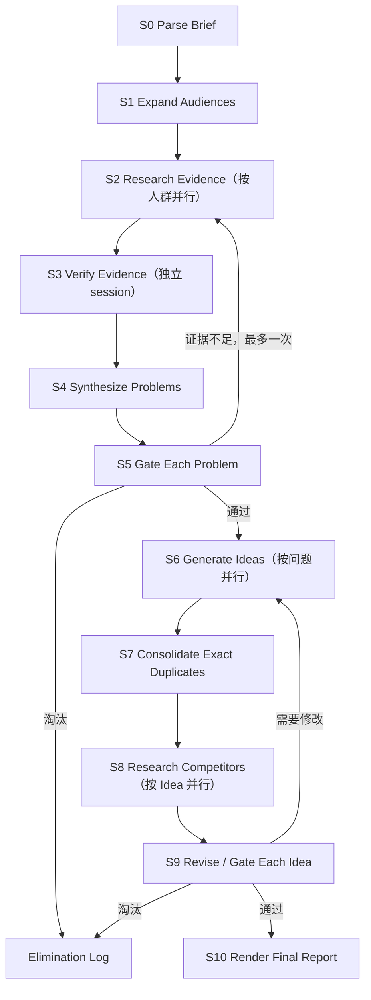

# Useful Idea v0.1：Workflow Contracts

> 状态：讨论草案。本文件会逐阶段确定输入、输出、Prompt、memory 读取范围、session 边界和回路；未标记“已确认”的部分均可修改。

## 1. 为什么需要这份契约

Workflow 不能只是一张阶段流程图。每个节点都必须能回答：

1. 这个 Agent 此刻只负责什么？
2. 它看到哪些事实，又刻意看不到哪些内容？
3. 它必须交付什么可校验产物？
4. 什么情况下通过、重试、回退或淘汰？
5. 下一名 Agent 依据什么继续，而不是依赖上一段聊天记忆？

### 与 ClaudeHack 的关系

ClaudeHack 已经验证了“Python 控制器 + 独立 CLI session + 文件化阶段交接 + workspace 恢复”这条路。HackSome 建议直接继承这一骨架，再为本轮新增的 evidence verification、绝对门槛和非线性回路补上更严格的 artifact 契约。详细核对见 [`research/claudehack-workflow-contracts.md`](./research/claudehack-workflow-contracts.md)。

这里要保留 ClaudeHack 的一个重要抽象：**一个 Workflow Stage 不等于一个 Agent。** 一个 Stage 可以并行运行多个搜索或复核 session，但对外只提交一种明确的阶段产物。

## 2. 建议的最小阶段图



这里的并行只表示可以同时运行多个独立任务，不表示必须限制候选数量，也不表示必须强制不同方向。

## 3. 阶段契约草案

| 阶段 | 目的 | 主要输入 | 主要输出 | 建议的 session 边界 |
|---|---|---|---|---|
| S0 Parse Brief | 把原始题目变成不脑补的事实边界 | 原始题目、规则、附件 | 完整 `ChallengeBrief`、`DiscoveryView`、`ComplianceView`、未知项 | 新 session；也可后续改为确定性代码 |
| S1 Expand Audiences | 只扩散相关职业、人群和类型，不联网 | `DiscoveryView`、Useful 全局原则 | `AudienceList` | 新 session；不开放 web search |
| S2 Research Evidence | 为一个人群寻找自然问题材料 | `DiscoveryView`、单个 Audience、来源规则；追加轮再加明确的搜索缺口 | `research/<audience-id>/<researcher-id>.md`，每个 Agent 一份 | 每个人群首轮默认 3 个同输入的独立新 session；数量可配置，不设汇合 session |
| S3 Verify Evidence | 重新打开来源并验证主张 | 单条或小批 Evidence、关联 Audience | `VerifiedEvidence[]` | 与 Researcher 分离的新 session |
| S4 Synthesize Problems | 从已验证材料中发现真实场景并聚类问题 | `ChallengeBrief`、某人群的 Verified Evidence | `ProblemCard[]` | 每个人群独立新 session |
| S5 Gate Each Problem | 用绝对门槛判断问题，不做相对排名 | 单张 Problem Card、其引用的 Verified Evidence、门槛 | `ProblemDecision` | 每个问题独立新 session |
| S6 Generate Ideas | 围绕一个过线问题提出完整产品介入方式 | 单张通过的 Problem Card、其证据、Idea 原则 | `IdeaDraft[]` | 每个并行生成任务独立新 session |
| S7 Consolidate | 识别完全重复的草稿并保留来源关系 | 同一问题下全部 Idea Drafts | `IdeaCandidate[]`、重复映射 | 新 session；不因相似而强制淘汰 |
| S8 Research Competitors | 在 Idea 已形成后检查已有方案与切换理由 | 单张 Idea Candidate、Problem Card、来源规则 | `CompetitiveCheck` | 每个 Idea 独立新 session |
| S9 Revise / Gate Idea | 根据竞品与端到端完整性修改或淘汰 | Idea Candidate、Problem Card、Verified Evidence、Competitive Check | 最终 `IdeaCard` 或 `IdeaDecision` | 每个 Idea 独立新 session |
| S10 Render Report | 把结构化结果生成人类可读报告 | 所有通过项、淘汰记录、run metadata | `report.md` | 优先用确定性代码，不调用 Agent |

## 4. Shared memory：已确认的基本模型

共享 memory 以普通文件为中心，不共享完整 Agent 对话，也不要求把每份文档包装成一个 package。不同文件根据用途分为六类：

| Memory | 内容 | 谁能写 | 谁能读 |
|---|---|---|---|
| `Method Memory` | Useful 原则、来源规则、质量门槛、阶段 Prompt 版本 | 项目维护者 | 按阶段加载必要部分 |
| `Run Brief` | 本次题目、规则、硬约束、未知项 | S0，经校验后冻结 | 所有需要理解赛题的阶段 |
| `Evidence Corpus` | 多份独立研究文档及后续独立复核文档；包含 URL、原文、查询记录和来源关系 | 每个阶段的 Agent 只创建自己的文档，不改写上游文档 | 证据复核、问题判断及需要引用证据的下游 Agent |
| `Living Documents` | Problem、Idea，以及后续的 PRD、Pitch 等会被多轮发展的 Markdown 文件 | 被当前 workflow 授权的 Agent | 需要继续发展该文档的 Agent |
| `Decision Log` | 通过、重试、修改、合并、淘汰及理由 | Orchestrator 追加 | 恢复流程与最终报告；普通生成 Agent 默认不全读 |
| `Session Record` | Codex session id、事件日志、token、退出码 | Codex Runner | 恢复与调试；不作为产品事实输入 |

核心规则是：**Agent 通过明确的共享文件协作，聊天历史不是跨 Agent memory。**

其中两种文件有不同的生命方式：

- Research、Verification、Run Brief 和 Decision 都保留历史：Agent 可以创建后续文档并引用上游结果，但不能为了让结论更好看而改写原记录。
- Living Document 是正文：第一次创建后，第二次、第三次以及后续 Agent 都可以基于同一文件继续编辑。它本身就是共享文档，不需要被包进额外的数据对象。

完整 `ChallengeBrief` 另外提供两个读取视图：需求发现阶段只读 `DiscoveryView`；强制技术、Sponsor 要求和交付限制保留在 `ComplianceView`，直到 Idea 草案形成后才开放。这两个视图由同一 Brief 生成，不各自维护一份事实。

这样做意味着：

- 每个 Agent 都拿到一个小而明确的 Context Packet，而不是整个 run 的历史。
- Context Packet 可以直接指定一个需要读取或修改的共享 Markdown 文件路径。
- Evidence Verifier 看得到待验证的主张与来源，但看不到 Researcher 的长篇推理和自我评价。
- 第一轮 Idea Generator 看不到竞品材料，直到独立构思完成。
- 一个任务因断线或进程错误而恢复时，可以续接原 Codex session；进入新的判断阶段时默认开启新 session。
- 原始 JSONL 事件可以用于调试，但不会自动喂给下一名 Agent。

### 建议的简单目录

```text
runs/<run-id>/
  brief.json
  audiences.json
  research/
    audience-001/
      researcher-001.md
      researcher-002.md
      researcher-003.md
  problems/
    problem-001.md
  ideas/
    idea-001.md
  decisions.jsonl
  state.json
  logs/
```

这里的 `problem-001.md` 和 `idea-001.md` 是 Living Documents，Agent 可以直接围绕它们迭代。`researcher-001.md` 等研究文档和 `decisions.jsonl` 则保留不能被覆盖的事实轨迹。

### 并行修改协议：多人读，一次写回

当多个 Agent 在同一轮发展同一个 Living Document 时：

1. 所有 Agent 读取同一份 base revision。
2. 各自返回修改建议或 patch，不直接同时编辑 canonical 文件。
3. 一个 Editor Agent 读取 base revision 与全部建议，合并互补修改、处理冲突，并保留有价值的相似方案。
4. Editor 只写回一次共享文件，形成下一 revision。
5. 下一轮所有 Agent 从新 revision 继续。

共享正文始终只有一份。并行建议只是该轮的临时工作材料，不需要发展成复杂 package。需要长期保留的是新正文、修改来源和关键采纳/拒绝理由。

这个协议不适用于 S2：并行 Research Agent 不是在共同修改一篇文章，而是在独立提交研究结果，因此各自保存文档，下游同时读取，不需要 Editor 先合并。

## 5. Prompt 契约草案

每个阶段 Prompt 固定由六块组成：

1. **本阶段任务**：只说明这一步必须完成的工作。
2. **允许使用的输入**：列出 artifact id、版本及其内容或文件路径。
3. **本阶段方法**：例如 GitHub/Reddit 搜索策略或绝对质量门槛。
4. **禁止事项**：例如不得臆造场景、不得把相似当作淘汰原因。
5. **停止与失败条件**：什么时候应该返回证据不足，而不是继续编写。
6. **输出 Schema**：严格定义字段、枚举和引用关系。

少量跨阶段不变的原则放入短小的 Method Memory。具体任务、候选内容和阶段规则留在对应 Prompt 中，避免一个不断膨胀的“万能 System Prompt”。

每次执行保存：

- `prompt_template_id`
- `prompt_version`
- 输入 artifact ids 与版本
- 输出 artifact ids
- Codex session id
- 开始/结束时间、状态和失败原因

## 6. 尚待逐项确认

1. S0–S10 是否需要合并，尤其是 S4/S5 与 S7/S9。
2. 每个问题启动几个并行 Idea Generator，以及何时认为继续生成已经重复。
3. Evidence 与 Problem 的最低充分证据标准。
4. 每个阶段的完整 JSON Schema 与 Prompt 文本。

## 7. 已确认的 S0 / S1 契约

### S0 — Parse Challenge

**输入**

- 用户提供的原始题目、规则文本和附件

**输出**

- 完整 `ChallengeBrief`
- `DiscoveryView`
- `ComplianceView`
- 明确的未知项和互相冲突的规则

**Prompt 重点**

- 只提取原文事实，不补全、不构思人群、不提出 Idea。
- 缺失信息写成 unknown；冲突内容原样保留并标记。

**Memory**

- 只读原始输入和 Challenge parsing 规则。
- 不读任何历史 benchmark 的人群、问题或 Idea。

### S1 — Expand Audiences

**输入**

- `DiscoveryView`
- 只扩散人群的阶段规则

**输出 `AudienceList`**

- 稳定 `audience_id`
- 人群名称
- 类型：职业、人群、社区或人生阶段等
- 与题目主题的直接关系
- 只用于搜索的名称别称或近义词

**Prompt 重点**

- 只列人群，不写他们正在做的具体任务。
- 不写场景、痛点、产品、技术方案或可能的产品类型。
- 不排名、不凑固定数量；合法空结果优于编造。

**Tools / Memory**

- v0.1 不开放网页搜索。
- 不读取 `ComplianceView`，避免指定技术影响需求方向。
- 不读取其他 run 的人群结果。

### S2 — Research Evidence

S2 的单位不是“全场研究”，而是一个 Audience 的独立研究分支。不同 Audience 可以同时运行；同一 Audience 内也允许多个 Research Agent 同时寻找材料。

**输入**

- `DiscoveryView`
- 一条 Audience 记录及其搜索别称
- 来源、引用和禁止脑补的规则
- 本轮搜索预算
- 只有追加轮才会提供：证据复核或问题归纳阶段指出的具体搜索缺口，以及已经访问的 URL 和查询记录

**首轮并行方式**

- v0.1 默认启动 3 个彼此隔离的 Research Agent，数量可以由运行配置调整。
- 三个 Agent 得到相同输入，不预分配“效率”“成本”“协作”等假想痛点，也不强制搜索不同方向。
- Agent 之间不读取彼此的结果。相似发现不算失败：若它们来自独立材料，反而可能说明问题反复出现。
- “3 个”只描述首轮计算量，不代表必须产出 3 条证据、3 个问题或任何固定数量的结果。

**Research Agent 的 Prompt 重点**

- 先判断这个人群会在哪里自然讨论工作和问题，再据此选择搜索位置；GitHub 和 Reddit 在相关时优先，但不设平台配额。
- 寻找真实行为、抱怨、重复劳动、失败经历、已付出的时间或金钱、现有 workaround，以及评论中的反驳或反例。
- 每条材料保留 URL、可定位的原文摘录、日期或时间线索、上下文和对应查询，不能只写搜索摘要。
- 可以提出“这段材料可能说明什么问题”的暂定主张，但不能创建正式 Problem Card、执行问题门槛、提出产品 Idea 或讨论 Sponsor 技术。
- 可以合法返回空结果，并说明尝试过什么；不得为了交差把推测写成用户问题。

**Research Agent 输出**

每个 Agent 创建一份 `research/<audience-id>/<researcher-id>.md`。这份文档包含：

1. `EvidenceCandidate[]`
   - 文档内的局部编号
   - 来源平台、URL、页面时间和访问时间
   - 原文摘录及其必要上下文
   - 它与当前 Audience 的关系
   - 暂定的问题主张与已观察到的 workaround
   - 反例、冲突信号和仍不确定之处
   - 产生该材料的查询
2. `QueryRecord[]`
   - 查询内容、搜索位置和结果是否相关
   - 无结果、登录墙、页面失效等访问失败
   - 本轮尚未补齐的具体搜索缺口

证据的稳定引用由“研究文档路径 + 文档内局部编号”组成，因此并行 Agent 不需要争用全局编号。

**独立文档，不做 S2 汇合**

- 三个 Agent 分别写自己的文档，不读取或修改其他 Research Agent 的文档。
- S2 完成后，Orchestrator 只校验文件存在、基本结构有效，并记录全部路径；它不对内容去重、归纳或筛选。
- 相同 URL 可以在多份文档中出现，相同问题也可以被多个 Agent 独立发现。这些关系留给后续阶段判断，不在 S2 中提前抹平。
- S3 和 S4 获得的是该 Audience 的研究文档列表，而不是一份经过 Editor 重写的统一摘要。

**停止与追加研究**

- 首轮不是因为“凑够 N 条”而停止，而是在配置的首轮 Agent 都完成自己的研究文档后结束。
- 若后续证据复核或问题归纳能指出一个具体缺口，例如某个反复出现的主张只有转述而没有原帖，可以再启动一轮有边界的搜索；追加轮只围绕这些缺口，不重跑整个人群研究，并产生新的独立文档。
- 如果新增搜索不再带来实质证据，或多次合理查询后仍没有自然材料，该 Audience 分支停止并保留空结果或不确定结论。
- S2 只把材料送往 S3，不在这里把任何候选主张升级为正式问题。
