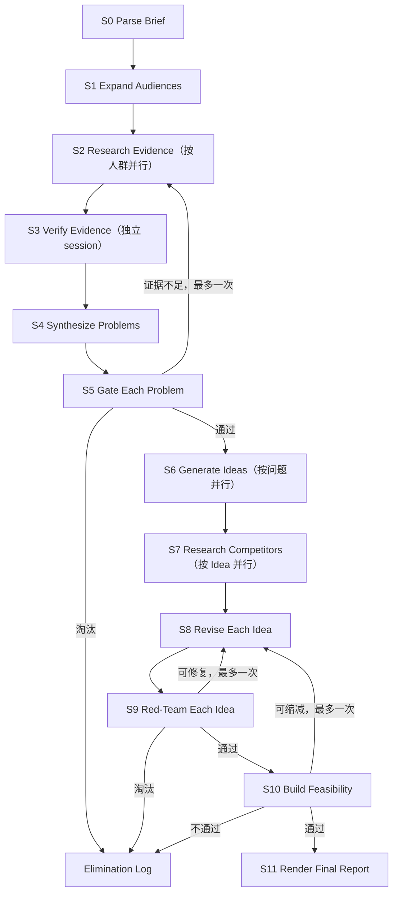

# Useful Idea v0.1：Workflow Contracts

> 状态：讨论草案。本文件会逐阶段确定输入、输出、Prompt、memory 读取范围、session 边界和回路；未标记“已确认”的部分均可修改。

## 1. 为什么需要这份契约

Workflow 不能只是一张阶段流程图。每个节点都必须能回答：

1. 这个 Agent 此刻只负责什么？
2. 它看到哪些事实，又刻意看不到哪些内容？
3. 它必须交付什么可校验产物？
4. 什么情况下通过、重试、回退或淘汰？
5. 下一名 Agent 依据什么继续，而不是依赖上一段聊天记忆？

### 与 ClaudeHack 的关系

ClaudeHack 已经验证了“Python 控制器 + 独立 CLI session + 文件化阶段交接 + workspace 恢复”这条路。HackSome 建议直接继承这一骨架，再为本轮新增的 evidence verification、绝对门槛和非线性回路补上更严格的 artifact 契约。详细核对见 [`research/claudehack-workflow-contracts.md`](./research/claudehack-workflow-contracts.md)。

这里要保留 ClaudeHack 的一个重要抽象：**一个 Workflow Stage 不等于一个 Agent。** 一个 Stage 可以并行运行多个搜索或复核 session，但对外只提交一种明确的阶段产物。

## 2. 建议的最小阶段图



这里的并行只表示可以同时运行多个独立任务，不表示必须限制候选数量，也不表示必须强制不同方向。

## 3. 阶段契约草案

| 阶段 | 目的 | 主要输入 | 主要输出 | 建议的 session 边界 |
|---|---|---|---|---|
| S0 Parse Brief | 把原始题目变成不脑补的事实边界 | 原始题目、规则、附件 | 完整 `ChallengeBrief`、`DiscoveryView`、`ComplianceView`、未知项 | 新 session；也可后续改为确定性代码 |
| S1 Expand Audiences | 只扩散相关职业、人群和类型，不联网 | `DiscoveryView`、Useful 全局原则 | `AudienceList` | 新 session；不开放 web search |
| S2 Research Evidence | 为一个人群寻找自然问题材料 | `DiscoveryView`、单个 Audience、来源规则；追加轮再加明确的搜索缺口 | `research/<audience-id>/<researcher-id>.md`，每个 Agent 一份 | 每个人群首轮默认 3 个同输入的独立新 session；数量可配置，不设汇合 session |
| S3 Verify Evidence | 重新打开研究文档中的每个来源并逐条验证 | 一份 Research 文档、关联 Audience、复核规则 | `verification/<audience-id>/<researcher-id>/verifier-<n>.md` | 每份 Research 文档先用一个独立新 session；有争议时再开第二个，不设汇合 session |
| S4 Synthesize Problems | 从已验证材料中发现真实场景并形成问题文档 | `DiscoveryView`、单个 Audience、该人群全部 Research 与 Verification 文档 | `problems/<audience-id>/<writer-id>/<problem-id>.md` | 每个人群默认 3 个同输入的独立新 session；数量可配置，不设汇合 session |
| S5 Gate Each Problem | 用绝对门槛判断问题，不做相对排名 | 单份 Problem 文档、其引用及相关的 Research / Verification 文档、门槛 | `gateways/<problem-ref>/gateway-<n>.md` | 每个问题先用一个独立新 session；候选淘汰再开第二个盲审 session |
| S6 Generate Ideas | 围绕一个过线问题提出端到端产品介入方式 | 单张通过的 Problem 文档、Gateway 通过记录、已验证证据、Idea 原则 | `ideas/<problem-ref>/<generator-id>/<idea-id>.md` | 每个问题默认 5 个同输入的独立新 session；数量可配置，不设汇合 session |
| S7 Research Competitors | 在 Idea 已形成后检查已有方案与切换理由 | 单份 Idea Draft、Problem 文档、来源规则 | `competition/<idea-ref>/researcher-<n>.md` | 每个 Idea 首轮一个独立新 session；明确缺口可追加一个定向 session，所有 Idea 可并行 |
| S8 Revise Idea | 根据竞品材料继续发展 Idea，而不自我批准 | Idea Draft、Problem 文档、Verified Evidence、竞品研究、`ComplianceView` | 一份新的 Idea Card revision | 每个 Idea 独立新 session |
| S9 Red-Team Idea | 对抗性判断 Idea 本身是否成立：真实用户价值、真实 User Flow、价值交付、采用理由和 Problem 忠实度 | 完成的 Idea Card revision、Problem、必要证据与竞品研究 | `idea-reviews/<idea-ref>/red-team-<n>.md` | 与 S8 分离的全新 session；最多返回 S8 修改一次，第二次未通过即淘汰 |
| S10 Build Feasibility | 独立检查能否在黑客松时间内做出真实端到端 Beta | 通过 Red Team 的 Idea Card、运行预算、本地能力与可用依赖 | `feasibility/<idea-ref>/review-<n>.md` | 每个 Idea 一个独立新 session；最多返回 S8 缩减一次，缩减后重走 S9 / S10 |
| S11 Render Report | 把全部通过项与淘汰轨迹生成人类可读报告 | 最终 Idea Card、证据与评审文件路径、淘汰记录、run metadata | `idea-report.md` | 只用确定性代码，不调用 Agent、不排名 |

## 4. Shared memory：已确认的基本模型

共享 memory 以普通文件为中心，不共享完整 Agent 对话，也不要求把每份文档包装成一个 package。不同文件根据用途分为六类：

| Memory | 内容 | 谁能写 | 谁能读 |
|---|---|---|---|
| `Method Memory` | Useful 原则、来源规则、质量门槛、阶段 Prompt 版本 | 项目维护者 | 按阶段加载必要部分 |
| `Run Brief` | 本次题目、规则、硬约束、未知项 | S0，经校验后冻结 | 所有需要理解赛题的阶段 |
| `Evidence Corpus` | 多份独立研究文档及后续独立复核文档；包含 URL、原文、查询记录和来源关系 | 每个阶段的 Agent 只创建自己的文档，不改写上游文档 | 证据复核、问题判断及需要引用证据的下游 Agent |
| `Living Documents` | Problem、Idea，以及后续的 PRD、Pitch 等会被多轮发展的 Markdown 文件 | 被当前 workflow 授权的 Agent | 需要继续发展该文档的 Agent |
| `Decision Log` | 通过、重试、修改、合并、淘汰及理由 | Orchestrator 追加 | 恢复流程与最终报告；普通生成 Agent 默认不全读 |
| `Session Record` | Codex session id、事件日志、token、退出码 | Codex Runner | 恢复与调试；不作为产品事实输入 |

核心规则是：**Agent 通过明确的共享文件协作，聊天历史不是跨 Agent memory。**

其中两种文件有不同的生命方式：

- Research、Verification、Run Brief 和 Decision 都保留历史：Agent 可以创建后续文档并引用上游结果，但不能为了让结论更好看而改写原记录。
- Living Document 是正文：第一次创建后，第二次、第三次以及后续 Agent 都可以基于同一文件继续编辑。它本身就是共享文档，不需要被包进额外的数据对象。

完整 `ChallengeBrief` 另外提供两个读取视图：需求发现阶段只读 `DiscoveryView`；强制技术、Sponsor 要求和交付限制保留在 `ComplianceView`，直到 Idea 草案形成后才开放。这两个视图由同一 Brief 生成，不各自维护一份事实。

这样做意味着：

- 每个 Agent 都拿到一个小而明确的 Context Packet，而不是整个 run 的历史。
- Context Packet 可以直接指定一个需要读取或修改的共享 Markdown 文件路径。
- Evidence Verifier 看得到待验证的主张与来源，但看不到 Researcher 的长篇推理和自我评价。
- 第一轮 Idea Generator 看不到竞品材料，直到独立构思完成。
- 一个任务因断线或进程错误而恢复时，可以续接原 Codex session；进入新的判断阶段时默认开启新 session。
- 原始 JSONL 事件可以用于调试，但不会自动喂给下一名 Agent。

### 建议的简单目录

```text
runs/<run-id>/
  brief.json
  audiences.json
  research/
    audience-001/
      researcher-001.md
      researcher-002.md
      researcher-003.md
  verification/
    audience-001/
      researcher-001/
        verifier-001.md
  problems/
    audience-001/
      writer-001/
        problem-001.md
  gateways/
    audience-001/
      writer-001/
        problem-001/
          gateway-001.md
  ideas/
    audience-001/
      writer-001/
        problem-001/
          generator-001/
            idea-001.md
  competition/
    audience-001/
      writer-001/
        problem-001/
          generator-001/
            idea-001/
              researcher-001.md
  idea-reviews/
    audience-001/
      writer-001/
        problem-001/
          generator-001/
            idea-001/
              red-team-001.md
  feasibility/
    audience-001/
      writer-001/
        problem-001/
          generator-001/
            idea-001/
              review-001.md
  idea-report.md
  decisions.jsonl
  state.json
  logs/
```

这里的 `problem-001.md` 和 `idea-001.md` 是 Living Documents，Agent 可以直接围绕它们迭代。`researcher-001.md` 等研究文档和 `decisions.jsonl` 则保留不能被覆盖的事实轨迹。

### 写入所有权

- 每个并行任务在启动前获得唯一输出路径，不能与其他运行中任务写同一个文件。
- 同一份 Living Document 同一时间只有一个授权 Writer；下一次修改必须等待当前 revision 完成并通过校验。
- 当前 S0–S11 的并行阶段全部写独立文档，不需要内容合并机制。

## 5. Prompt 契约草案

每个阶段 Prompt 固定由六块组成：

1. **本阶段任务**：只说明这一步必须完成的工作。
2. **允许使用的输入**：列出 artifact id、版本及其内容或文件路径。
3. **本阶段方法**：例如 GitHub/Reddit 搜索策略或绝对质量门槛。
4. **禁止事项**：例如不得臆造场景、不得把相似当作淘汰原因。
5. **停止与失败条件**：什么时候应该返回证据不足，而不是继续编写。
6. **输出 Schema**：严格定义字段、枚举和引用关系。

少量跨阶段不变的原则放入短小的 Method Memory。具体任务、候选内容和阶段规则留在对应 Prompt 中，避免一个不断膨胀的“万能 System Prompt”。

每次执行保存：

- `prompt_template_id`
- `prompt_version`
- 输入 artifact ids 与版本
- 输出 artifact ids
- Codex session id
- 开始/结束时间、状态和失败原因

## 6. 尚待逐项确认

1. Evidence 与 Problem 的最低充分证据标准。
2. Agent Prompt 和文档正文的默认语言及多语言规则。
3. 每个阶段的最终 Prompt 模板、front matter 枚举和正文标题契约。

## 7. 通用文档信封：已确认

Research、Verification、Problem、Idea、竞品、Red Team 和 Feasibility 等长文档采用 Markdown + YAML front matter。正文是人和 Agent 共同工作的主要内容，不再保存语义重复的 JSON sidecar。

```yaml
---
schema_version: 1
artifact_id: idea-001
artifact_type: idea
run_id: run-001
stage: S8
status: draft
revision: 2
created_by_session: session-abc
updated_by_session: session-def
source_refs:
  - problems/audience-001/writer-001/problem-001.md
supersedes: null
---
```

具体阶段可以增加必要字段，但不能删除上述公共字段。跨文档引用优先使用相对文件路径；文档内证据使用“路径 + 局部 id”。

Orchestrator 在阶段完成前检查：

- YAML 可以解析，公共字段与阶段状态枚举合法。
- `source_refs` 指向已存在且允许读取的上游文件。
- revision 与 `supersedes` 关系没有倒退或形成环。
- 阶段要求的正文标题存在。

校验失败属于可重试的执行错误，不是内容淘汰。`state.json`、任务索引、短结构化集合使用 JSON；决策和运行事件使用 JSONL。Codex 结构化输出只返回任务状态和写入路径，不重复长文档正文。

## 8. 已确认的 S0 / S1 契约

### S0 — Parse Challenge

**输入**

- 用户提供的原始题目、规则文本和附件

**输出**

- 完整 `ChallengeBrief`
- `DiscoveryView`
- `ComplianceView`
- 明确的未知项和互相冲突的规则

**Prompt 重点**

- 只提取原文事实，不补全、不构思人群、不提出 Idea。
- 缺失信息写成 unknown；冲突内容原样保留并标记。

**Memory**

- 只读原始输入和 Challenge parsing 规则。
- 不读任何历史 benchmark 的人群、问题或 Idea。

### S1 — Expand Audiences

**输入**

- `DiscoveryView`
- 只扩散人群的阶段规则

**输出 `AudienceList`**

- 稳定 `audience_id`
- 人群名称
- 类型：职业、人群、社区或人生阶段等
- 与题目主题的直接关系
- 只用于搜索的名称别称或近义词

**Prompt 重点**

- 只列人群，不写他们正在做的具体任务。
- 不写场景、痛点、产品、技术方案或可能的产品类型。
- 不排名、不凑固定数量；合法空结果优于编造。

**Tools / Memory**

- v0.1 不开放网页搜索。
- 不读取 `ComplianceView`，避免指定技术影响需求方向。
- 不读取其他 run 的人群结果。

### S2 — Research Evidence

S2 的单位不是“全场研究”，而是一个 Audience 的独立研究分支。不同 Audience 可以同时运行；同一 Audience 内也允许多个 Research Agent 同时寻找材料。

**输入**

- `DiscoveryView`
- 一条 Audience 记录及其搜索别称
- 来源、引用和禁止脑补的规则
- 本轮搜索预算
- 只有追加轮才会提供：证据复核或问题归纳阶段指出的具体搜索缺口，以及已经访问的 URL 和查询记录

**首轮并行方式**

- v0.1 默认启动 3 个彼此隔离的 Research Agent，数量可以由运行配置调整。
- 三个 Agent 得到相同输入，不预分配“效率”“成本”“协作”等假想痛点，也不强制搜索不同方向。
- Agent 之间不读取彼此的结果。相似发现不算失败：若它们来自独立材料，反而可能说明问题反复出现。
- “3 个”只描述首轮计算量，不代表必须产出 3 条证据、3 个问题或任何固定数量的结果。

**Research Agent 的 Prompt 重点**

- 先判断这个人群会在哪里自然讨论工作和问题，再据此选择搜索位置；GitHub 和 Reddit 在相关时优先，但不设平台配额。
- 寻找真实行为、抱怨、重复劳动、失败经历、已付出的时间或金钱、现有 workaround，以及评论中的反驳或反例。
- 每条材料保留 URL、可定位的原文摘录、日期或时间线索、上下文和对应查询，不能只写搜索摘要。
- 可以提出“这段材料可能说明什么问题”的暂定主张，但不能创建正式 Problem Card、执行问题门槛、提出产品 Idea 或讨论 Sponsor 技术。
- 可以合法返回空结果，并说明尝试过什么；不得为了交差把推测写成用户问题。

**Research Agent 输出**

每个 Agent 创建一份 `research/<audience-id>/<researcher-id>.md`。这份文档包含：

1. `EvidenceCandidate[]`
   - 文档内的局部编号
   - 来源平台、URL、页面时间和访问时间
   - 原文摘录及其必要上下文
   - 它与当前 Audience 的关系
   - 暂定的问题主张与已观察到的 workaround
   - 反例、冲突信号和仍不确定之处
   - 产生该材料的查询
2. `QueryRecord[]`
   - 查询内容、搜索位置和结果是否相关
   - 无结果、登录墙、页面失效等访问失败
   - 本轮尚未补齐的具体搜索缺口

证据的稳定引用由“研究文档路径 + 文档内局部编号”组成，因此并行 Agent 不需要争用全局编号。

**独立文档，不做 S2 汇合**

- 三个 Agent 分别写自己的文档，不读取或修改其他 Research Agent 的文档。
- S2 完成后，Orchestrator 只校验文件存在、基本结构有效，并记录全部路径；它不对内容去重、归纳或筛选。
- 相同 URL 可以在多份文档中出现，相同问题也可以被多个 Agent 独立发现。这些关系留给后续阶段判断，不在 S2 中提前抹平。
- S3 和 S4 获得的是该 Audience 的研究文档列表，而不是一份统一摘要。

**停止与追加研究**

- 首轮不是因为“凑够 N 条”而停止，而是在配置的首轮 Agent 都完成自己的研究文档后结束。
- 若后续证据复核或问题归纳能指出一个具体缺口，例如某个反复出现的主张只有转述而没有原帖，可以再启动一轮有边界的搜索；追加轮只围绕这些缺口，不重跑整个人群研究，并产生新的独立文档。
- 如果新增搜索不再带来实质证据，或多次合理查询后仍没有自然材料，该 Audience 分支停止并保留空结果或不确定结论。
- S2 只把材料送往 S3，不在这里把任何候选主张升级为正式问题。

### S3 — Verify Evidence

S3 按研究文档分派，而不是先把所有证据混在一起。每份 `research/<audience-id>/<researcher-id>.md` 至少对应一份独立复核文档。

**输入**

- 一份完整 Research 文档
- 关联 Audience
- 来源复核规则和允许使用的网页访问工具
- 第二次复核时，只额外指出需要重查的局部证据编号；不提供第一名 Verifier 的结论

Verifier 不继承 Research Agent 的 Codex session、聊天记录或自我评价。它可以读取研究文档中为了复核所必需的来源、摘录、上下文和暂定主张。

**Prompt 重点**

- 亲自重新打开每个原始 URL，不能因为 Research Agent 已引用它就默认可信。
- 检查页面是否可访问、摘录是否能在页面中定位、是否遗漏了改变含义的上下文、说话者是否属于目标人群，以及暂定主张有没有超出原材料。
- 把事实复核与产品判断分开：不创建 Problem Card、不执行问题门槛、不提出 Idea，也不为失败证据寻找替代来源。
- 找不到页面、页面需要无法提供的权限或内容已经删除时，如实标记“无法访问”，不能凭搜索摘要补证。

**逐条结果**

每条 Evidence Candidate 保留原来的“研究文档路径 + 局部编号”，并获得：

- `支持`：来源可访问，摘录和上下文准确，材料实际支持该暂定主张。
- `部分支持`：材料真实，但只支持主张的一部分或更窄的说法。
- `不支持`：来源可访问，但摘录、上下文、人群归属或原意不能支持该主张。
- `无法访问`：Verifier 无法独立打开或定位原始材料。
- 简短、可检查的理由，以及必要时建议缩窄到什么范围；不得直接改写原证据。

**独立输出**

- 第一名 Verifier 写入 `verification/<audience-id>/<researcher-id>/verifier-001.md`。
- 原 Research 文档保持不变；复核文件也不回写或覆盖它。
- 不生成总 verification 文档。S4 同时读取该 Audience 下全部 Research 文档及其对应的复核文档。

**第二次复核与停止**

- 如果第一份复核中出现“部分支持”、材料内部冲突或理由仍然模糊，Orchestrator 可把相关局部编号交给第二个全新 session。
- 第二名 Verifier 不读取第一份复核文档，结果写入同目录下的 `verifier-002.md`。
- 两份判断同时保留，不做简单多数投票，也不覆盖旧结论。若仍不能消除分歧，该证据以“不确定”状态进入 S4，不能单独承担正面问题主张。
- 当研究文档中的每条证据都有第一份复核结果，且所有触发第二次复核的项目都已完成或被明确保留为不确定时，S3 结束。

### S4 — Synthesize Problems

S4 的职责是把已经复核的原料写成清楚、可引用的问题文档。它不继续查资料，也不判断问题是否值得进入 Idea 阶段。

**输入**

- `DiscoveryView`
- 一条 Audience 记录
- 该 Audience 下全部独立 Research 文档
- 上述 Research 文档对应的全部 Verification 文档
- Problem 文档格式及禁止臆造的规则

S4 不读取 `ComplianceView`、Sponsor 技术、已有产品 Idea、其他 Audience 的材料或其他 Problem Writer 的输出。

**并行方式**

- 每个 Audience 默认启动 3 个彼此隔离的 Problem Writer，数量可以配置。
- 三个 Writer 得到完全相同的输入，不预分配方向，也不要求彼此找到不同问题。
- 每个 Writer 可以创建零到多份 Problem 文档；“3 个 Writer”不是要求产出 3 个问题。
- Writer 之间不读取彼此的文件，也不汇总结果。相同或相近的问题可以同时存在，交给 S5 独立判断。

**Prompt 重点**

- 从证据中识别自然出现的具体场景、受影响人群和问题，不能把初始宽泛 Audience 直接改写成未经证据支持的细分人群。
- 只有标记为“支持”的 Evidence 可以单独承担正面主张；“部分支持”只能支撑更窄的说法或作为不确定项，“不支持”“无法访问”和仍有分歧的材料不能被当作正面依据。
- 保留不同来源之间的相互印证、反例和矛盾，但不以来源数量自动代替判断。
- 只描述用户现状、问题、后果和现有 workaround，不提出产品、功能、Sponsor 技术或解决方案。
- 不执行质量门槛、不给问题排名，也不为了凑数量而拆分或编造问题。合法空结果优于伪问题。

**每份 Problem 文档至少包含**

- 文档所属的 `audience_id`、`writer_id` 和局部 `problem_id`
- 从证据中得到的具体人群；若比初始 Audience 更细，必须说明依据
- 问题发生的真实场景
- 一句话问题描述及其实际后果
- 当前 workaround，以及已观察到的时间、金钱、风险或其他付出
- 反复发生或单次严重性的现有信号，但不在这里宣布门槛已满足
- 逐条证据引用：Research 文档路径、局部 Evidence id 及对应 Verification 文档
- 反例、相互冲突的材料、尚未确认的假设和明确的搜索缺口
- 当前版本及创建者；不得包含产品 Idea 或 Gateway 结论

**文件与停止条件**

- 每个 Writer 把结果写入 `problems/<audience-id>/<writer-id>/<problem-id>.md`，不同 Writer 不共享编号空间。
- S4 不把这些文件再混成总文档，也不删除相似文件。
- 当配置的 Writer 全部完成并且每份输出通过基本结构校验后，S4 结束；零份 Problem 文档也是合法结果。
- 后续若 S5 要求补证，先回到有边界的 S2 追加研究并重新经过 S3；需要重写问题时生成新的 Problem revision，S5 不直接改原文档。

### S5 — Gate Each Problem

S5 是独立 Gateway：它判断一份 Problem 文档是否已经足以进入 Idea 生成，但不比较候选、不限制通过数量，也不改写 Problem 文档。

**输入**

- 单份 Problem 文档及其 revision
- 该文档引用的 Research 与 Verification 文档
- 同一 Audience 下能够提供反证或独立印证的其他 Research / Verification 文档
- Problem 绝对门槛和当前补证次数

Gateway 不读取其他 Problem 文档、任何产品 Idea、竞品材料或 `ComplianceView`，避免把相对排名、解决方案偏好和 Sponsor 技术带入问题判断。

**逐项门槛**

Gateway 必须分别判断并引用依据：

1. 问题确实发生在所描述的人群和场景中，而不是 Agent 推测。
2. 问题反复发生，或者虽然少见但单次后果严重。
3. 用户已经为它付出时间、金钱、风险，或采用明显麻烦的 workaround。
4. 软件有机会带来实质改善，而不只是增加一个界面；这里判断可改善性，不构思具体产品。
5. Problem 文档没有把未经验证的假设、单个极端案例或解决方案伪装成问题事实。

每一项记录 `满足`、`不满足` 或 `证据不足`，并引用具体文件和局部 Evidence id。来源条数本身不能代替对内容的判断。

**第一次 Gateway**

- 使用与 S4 分离的新 session，输出 `gateways/<problem-ref>/gateway-001.md`。
- `通过`：所有必要门槛均有足够依据，直接进入 S6。
- `需要补证`：尚不能判定某项，但存在一个具体、可搜索的证据缺口。Gateway 必须写出缺什么，不能只说“研究不够”。
- `候选淘汰`：已有材料明确显示至少一个必要门槛不满足。第一次判断不能直接淘汰。

**补证回路**

- `需要补证` 返回 S2，只围绕 Gateway 指出的缺口产生新的独立 Research 文档，再经过 S3 复核。
- S4 根据新增材料创建新的 Problem revision；Gateway 不直接编辑原 Problem。
- v0.1 每个问题最多执行一次内容补证回路。新的 revision 必须由新的 Gateway session 判断，不能恢复第一次 Gateway 让它证明自己正确。

**淘汰双重确认**

- `候选淘汰` 触发 `gateway-002.md`。第二名 Gateway 得到相同事实输入和门槛，但看不到 `gateway-001.md`。
- 只有两个 Gateway 都把同一个必要门槛判为“不满足”，并分别给出可检查依据时，Orchestrator 才写入最终淘汰记录。
- 若第二名 Gateway 通过、认为证据不足，或拒绝理由落在不同门槛，当前结果记为“待确认”。尚有补证预算时，只能围绕分歧中明确的证据缺口进入一次定向补证；没有补证预算时直接淘汰。

**S5 已确认的停止点**

- `通过`：进入 S6。
- 双重确认淘汰：记录原因并停止该 Problem 分支。
- `需要补证`：尚有补证预算时进入一次定向回路。
- 补证完成后使用新的 Gateway session 重判；若仍出现 Gateway 分歧，直接淘汰并记录全部判断。v0.1 不增加第三名裁决者，也不允许该分支继续挂起。

### S6 — Generate Ideas

S6 从一份已经通过 S5 的 Problem 文档展开产品方案。它的任务是扩大可行解空间，同时确保每个 Draft 都指向一条真实、完整的用户流程。

**输入**

- 单份通过的 Problem 文档及对应 Gateway 通过记录
- Problem 引用的 Research 与 Verification 文档
- `DiscoveryView`
- Useful Idea 原则和 Idea Draft 格式

S6 不读取 `ComplianceView`、Sponsor 技术要求、竞品材料、其他 Problem 的内容或其他 Idea Generator 的输出。

**并行方式**

- 每个通过的 Problem 首轮默认启动 5 个彼此隔离的 Idea Generator，数量可以配置。
- 所有 Generator 得到完全相同的输入，不预分配“自动化”“协作”“分析”等方向，也不要求彼此差异。
- 每个 Generator 可以创建零到多份 Idea Draft；5 个 Agent 不代表需要 5 个 Idea。
- Generator 之间不读取彼此文件，S6 不设置汇总步骤，也不在本阶段排名、合并或淘汰。

**Prompt 重点**

- 先复述证据所支持的人群、场景、问题和当前完整流程，再确定产品介入位置；不得为了一个听起来新颖的产品偷偷改变原问题。
- 产品可以预防问题、完成步骤、辅助判断、减少交接或帮助恢复，但这些只是思考提示，不是必须凑齐的方向。
- 每个 Draft 必须形成端到端核心路径：用户提供真实输入，系统进行真实处理，并产生用户可使用的结果或现实动作。
- 不允许只输出名字、口号、功能清单、聊天框包装或使用假数据的前端展示。
- 不搜索或引用竞品，不讨论比赛指定技术是否适配；这些判断在后续阶段完成。
- 若没有成立的产品介入方式，可以返回空结果，不得为了满足数量要求编造 Idea。

**每份 Idea Draft 至少包含**

- `problem_ref`、`generator_id` 和文档内局部 `idea_id`
- 谁会使用，以及它服务的具体问题
- 用户采用产品之前的触发点
- 从真实输入、核心处理到可用结果或动作的完整使用流程
- 产品承担的核心机制和最小必要功能
- 相比当前 workaround，预期减少什么时间、成本、风险或失败
- 方案成立所依赖的关键假设和最可能失败的地方
- Problem 与 Evidence 引用
- 明确标记“尚未进行竞品检查与 Sponsor 技术检查”

商业模式、详细架构、完整页面清单和 Pitch 文案不属于 S6。

**文件与停止条件**

- 每个 Generator 写入 `ideas/<problem-ref>/<generator-id>/<idea-id>.md`，不同 Generator 不共享编号空间。
- 相似 Idea 分别保留，不因为缺乏方向差异而删除。
- 当配置的首轮 Generator 全部完成且文件通过基本结构校验后，本轮 S6 结束；零份 Idea Draft 是合法结果。
- Orchestrator 只建立 Idea Draft 路径索引；全部独立文档直接进入 S7 竞品研究，不经过 Consolidate 或语义去重阶段。

### S7 — Research Competitors

S7 在 Idea Draft 已经形成后再寻找现实中的替代方案。它提供外部材料，不修改产品方案，也不决定 Idea 是否存活。

**输入**

- 单份 Idea Draft
- 对应的 Problem、Gateway 通过记录及必要证据
- 竞品研究来源和引用规则
- 仅在追加轮提供：后续 Reviewer 指出的具体覆盖缺口、已经访问的 URL 与查询记录

S7 不读取其他 Idea Draft、其他 Idea 的竞品结果、`ComplianceView` 或 Sponsor 技术要求。

**执行方式**

- 每份 Idea Draft 首轮只启动 1 个独立 Competitor Researcher；不同 Idea 的任务可以全部并行。
- Researcher 使用新 session，结果写入 `competition/<idea-ref>/researcher-001.md`。
- 后续 Reviewer 若能指出明确缺口，可以增加 1 个定向 Researcher，写入 `researcher-002.md`；v0.1 最多追加一次。
- 两份研究文档分别保留，不生成中央汇总报告，也不修改原 Idea Draft。

**Prompt 重点**

- 同时从 Problem 的用户语言、当前流程和 Idea 的核心机制出发搜索，不能只搜索 Idea 自己起的产品名。
- 查找直接解决同一问题的产品、解决相邻步骤的产品、人工或通用工具替代办法、相关开源项目，以及曾经存在但失败或停运的方案。
- 重点寻找用户为什么采用、忍受、替换或放弃现有方案，而不只抄写竞品首页的营销文案。
- 记录定价、目标人群、核心流程、关键限制和产品状态时必须附可核实来源与访问日期；无法确认的内容明确标记未知。
- 找到高度相似产品并不等于自动淘汰。Researcher 只记录重合、差异、尚未被满足的部分和切换障碍。
- 不修改 Idea、不提出新版方案、不执行 Gateway，也不评价 Sponsor 技术适配。

**每份竞品研究文档至少包含**

- `idea_ref`、`researcher_id` 和研究范围
- 直接竞品、间接替代、相关开源项目与当前 workaround
- 每个方案的目标用户、核心流程、可验证能力、定价或获取方式、当前状态
- 用户采用、抱怨、替换或放弃它的证据
- 与 Idea Draft 的事实性重合与差异，不下最终结论
- URL、摘录或事实依据、查询记录、访问失败、反例和未覆盖区域

**停止与追加**

- 首轮文档完成并通过基本结构校验后，S7 可以把该 Idea 交给下一阶段。
- “研究不够深入”不能触发追加；必须由后续 Reviewer 指出具体缺失对象、搜索范围或未验证主张。
- 定向追加完成后不再启动第三个 Researcher。仍然无法确认的内容保留为未知，交给后续判断。

### S8 — Revise Idea

S8 负责把第一版 Idea Draft 与竞品事实结合，发展成可接受 Red Team 攻击的 Idea Card。它是作者，不是 Gateway。

**输入**

- 当前 Idea Draft 或最新 revision
- 对应 Problem、Problem Gateway 通过记录和必要证据
- 该 Idea 的全部竞品研究文档
- `ComplianceView`
- 仅在返工轮提供：首份 Red Team 文档

**行为边界**

- 可以修改产品机制、User Flow、功能边界和价值表达，但不能更换已通过的 Problem 或编造新用户需求。
- 必须正面处理竞品重合、用户采用理由和切换障碍；不能靠改名字或添加泛化 AI 功能制造差异。
- 在 Idea Card 中说明 Sponsor 技术可能承担的真实作用或明确说明不需要特殊技术，但 S8 不批准技术合规或工程可行性。
- 如果竞品材料存在一个阻止合理修改的具体缺口，可以触发 S7 唯一一次定向追加；不能以笼统的“还需研究”为由拖延。
- S8 不读取其他 Idea，不进行相对排名，也不能给自己写 Red Team 通过结论。

**Idea Card revision 至少包含**

- 使用者与所引用的 Problem
- 用户在什么时刻产生需求，以及能明确感知到的产品价值
- 从触发、真实输入、实际处理、结果或动作到价值时刻的完整 User Flow
- 核心产品机制和最小必要功能
- 当前 workaround 与竞品为什么不足，用户为什么会采用本产品
- Sponsor 技术可能承担的实际作用，以及仍待后续检查的合规或可行性假设
- Problem、Evidence、Gateway 和竞品文档引用
- 当前 revision、相对上一版的修改，以及仍未消除的风险

S8 更新该 Idea 的 Living Document，并由运行记录保存 revision 快照。首次竞品后产生第一份待审 Idea Card；S9 只允许把它返回 S8 修改一次。

### S9 — Red-Team Idea

S9 使用一个与作者完全分离的新 session，主动寻找 Idea 不成立的原因。它不润色、不补全、不改写 Idea，也不判断工程与比赛合规。

**输入**

- 最新 Idea Card revision
- 对应 Problem、Problem Gateway 通过记录和必要证据
- 该 Idea 的全部竞品研究文档
- Product Red Team 的判断规则

S9 不读取 S8 的聊天记录、其他 Idea、`ComplianceView` 或实现计划。第二次 Red Team 也不读取第一次 Red Team 文档，只评审最新 Idea revision 与原始事实。

**必须攻击的五个问题**

1. 目标用户能否在真实使用中明确感受到价值，而不是只得到抽象的“更智能”“更高效”。
2. 是否存在一条由触发、真实输入、产品实际处理、结果或现实动作组成的 User Flow，而不是页面顺序或功能清单。
3. 这条 Flow 是否真的因果性地交付了所声称的价值，还是在关键步骤依赖人工、假数据或未说明的魔法。
4. 相比当前 workaround 和已有产品，用户是否有真实采用或切换理由。
5. Idea 是否仍在解决已通过的 Problem，而没有为了让方案好看而偷偷改变用户、场景或问题。

每项必须给出攻击、Idea 中可检查的依据和结论，不能只给主观分数。

**输出与回路**

- 首次输出写入 `idea-reviews/<idea-ref>/red-team-001.md`，结果为 `通过`、`可修复` 或 `根本不成立`。
- `通过`：五项均成立，进入 S10 Build Feasibility。
- `可修复`：核心 Problem 与用户价值仍成立，但 Flow 或产品机制存在一个明确、局部且不需要改题的缺陷。Red Team 只描述失败条件，不替 S8 写解决方案。
- `根本不成立`：缺少可感知价值、缺少真实 User Flow，或只有更换已通过的 Problem 才能成立；立即淘汰。
- `可修复` 最多返回 S8 一次。S8 产生新 revision 后，由另一个新 session 写入下一个 `red-team-<n>.md`。
- 任何返工后的评审都只有 `通过` 才能继续；再次得到 `可修复` 或 `根本不成立` 都直接淘汰，并保留全部版本与评审记录。
- S10 触发的唯一一次范围缩减也必须重新经过新的 S9 session；它不恢复已经使用过的 S9 产品修复机会。

### S10 — Build Feasibility

S10 判断通过 Red Team 的产品能否在本次黑客松约束下做成真实、可运行的端到端 Beta。它不重新评价市场价值，也不承担 Sponsor 技术语义合规。

**输入**

- 最新且通过 S9 的 Idea Card revision 与对应 Red Team 文档
- 黑客松可用时间、人员与本地运行环境
- 已知可用的 API、模型、数据、账户和其他关键依赖
- v0.1 的交付定义：真实输入、真实处理、可用结果或动作，以及可重复演示的核心路径

**必须检查**

1. 核心 User Flow 的每个必要步骤是否能够实际实现，而不是只做静态页面或预录结果。
2. 最难的技术步骤、数据来源、外部 API、权限和账户是否真实可用；未知项是否足以让核心路径失效。
3. 在给定时间和本地环境内，能否完成、接通并验证这条核心路径，而不是只分别完成几个组件。
4. Demo 是否可以使用真实输入重复运行；人工操作可以属于正常用户流程，但不能暗中代替产品声称会完成的核心处理。
5. 缩减到可交付范围后，用户仍能走完整 User Flow 并感受到 S9 已通过的核心价值。

S10 必须给出关键路径、最高风险依赖和判断依据，不能只输出主观可行性分数。

**输出**

- 写入 `feasibility/<idea-ref>/review-<n>.md`，结果为 `可行`、`可通过缩减实现` 或 `根本不可行`。
- `可行`：核心路径能够按约束真实完成，进入 S11 最终报告。
- `可通过缩减实现`：只删除外围功能或降低非核心范围即可完成，且核心价值与 User Flow 不变。S10 写清必须保留、可以删除和仍需验证的内容，但不直接修改 Idea。
- `根本不可行`：只能依靠假数据、隐藏人工、未获得的关键依赖，或必须破坏核心价值 / User Flow 才能完成；立即淘汰。

**范围缩减回路**

- 每个 Idea 最多使用一次 S10 范围缩减机会。S8 根据 Feasibility 文档产生新 revision。
- 新 revision 先经过全新的 S9 Red Team；只有通过才能由另一个新的 S10 session 复查。
- 返工后的 S9 或 S10 任一不通过，都直接淘汰；不再增加第二次范围缩减。
- S10 不比较不同 Idea，也不因为总候选过多而淘汰一个本身可行的方案。

### S11 — Render Idea Report

S11 不是 Agent Stage，而是 Orchestrator 中的确定性 Renderer。它把已有事实组织成便于人阅读的入口，不产生新的判断。

**输入**

- 全部最终通过的 Idea Card 当前 revision
- 每个 Idea 对应的 Problem、Evidence、Verification、竞品、Red Team 与 Feasibility 文件路径
- 全部 Elimination Record
- run id、Prompt 版本、开始结束时间和阶段完成状态
- `ComplianceView` 中能够确定性检查的硬性必需字段与交付要求

**硬规则检查**

- Renderer 在输出前检查必需文件、引用路径、状态和确定性比赛字段是否齐全。
- 缺少硬性字段时报告构建失败并指出具体缺口；它不调用 Agent 猜测内容，也不进行 Sponsor 技术“是否有意义”的语义判断。

**`idea-report.md` 正文**

- 本次输入与运行摘要
- 所有最终通过的 Idea，按稳定创建 id 或文件路径排列，不使用分数、排名或 Top-K
- 每个 Idea 的用户、Problem、可感知价值、完整 User Flow、核心机制、现有替代及采用理由、可交付 Beta 范围、主要风险
- 指向独立 Problem、Research、Verification、竞品、Red Team、Feasibility 和 revision 文件的相对链接
- 淘汰附录：候选引用、淘汰阶段、触发的明确规则和决策文档链接

独立 Idea Card 是事实源；报告只抽取已有字段和建立链接，不能润色到改变含义，也不能把相似 Idea 合并成一个。

**停止条件**

- 所有引用存在、硬性字段齐全且 Markdown 成功写入后，Useful Idea workflow 完成。
- 如果没有 Idea 通过，仍生成合法 `idea-report.md`，明确显示零个通过项并提供完整淘汰轨迹。
