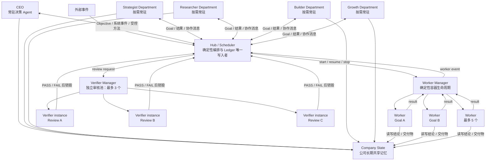
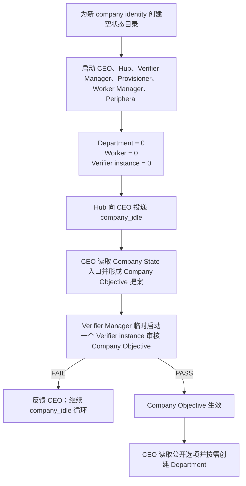
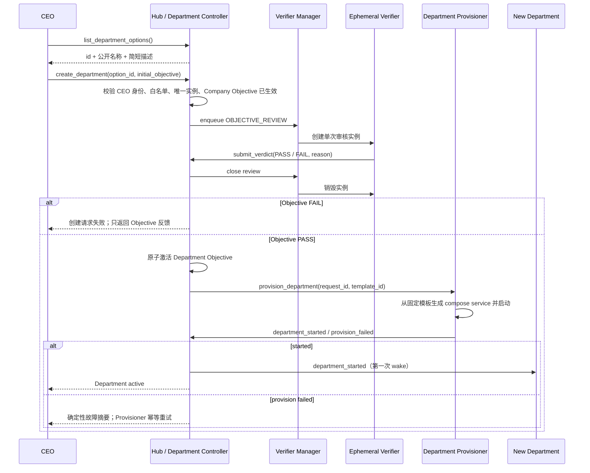
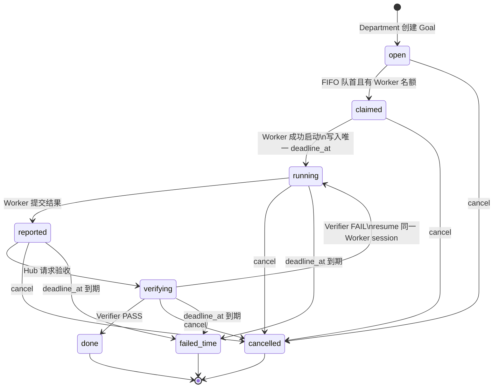
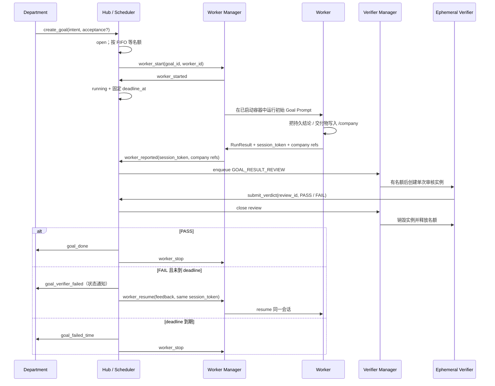
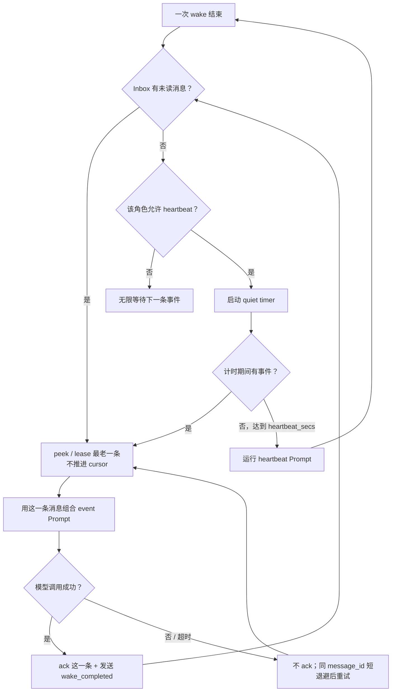
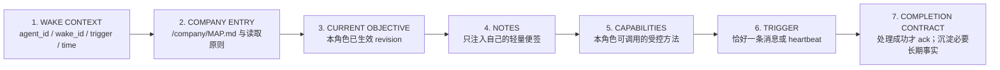

# 技术设计：三层主动 Agent Company

## 0. 设计结论

第一版不是在旧 test 上升级五个常驻角色，而是启动一个全新的 company stack：CEO 是唯一固定经营 Agent；Hub / Scheduler、Verifier Manager、Department Provisioner、Worker Manager 与外设入口属于无经营决策权的确定性基础服务。Department 由 CEO 从四个公开选项中按需创建；每个 Goal 由一个一次性 Worker 执行，每次结果提交再由一个独立的一次性 Verifier instance 审核。



设计中继续坚持三个边界：

1. LLM 负责经营判断和独立审核，Hub、状态机、Worker / Verifier 并发池、权限、计时与容器回收由确定性代码负责；
2. 对 LLM Agent 来说，公司状态中唯一可直接浏览的是 `/company`；Inbox、Ledger、Notes、review、Worker registry 与日志仍是独立的编排存储，但不挂载给 Agent；
3. Department 创建不需要 Verifier，但 Company Objective、Department Objective 和每个 Goal 的最终结果必须经过 Verifier。

## 1. 运行角色与启动机制

| 组件 | 生命周期 | 模型唤醒来源 | heartbeat | 主要职责 |
|---|---|---|---|---|
| CEO | 固定常驻 | Inbox 事件、`company_idle`、安静计时器 | 默认 900 秒 | Company Objective、组织与跨部门取舍 |
| Department | CEO 创建后常驻，第一版不可退役 | Inbox 事件、`company_idle`、安静计时器 | 模板默认 900 秒 | 围绕 Department Objective 主动创建 Goal、吸收结果 |
| Worker | 一个 Goal 一个临时容器 | 首次 Goal Prompt、Verifier FAIL 后 resume | 无 | 执行一个 Goal；不治理、不派生、不自审 |
| Verifier instance | 一个 review 一个临时容器 | Verifier Manager 传入单个审核 Prompt | 无常驻 loop | 独立给出一次 PASS / FAIL，随后销毁 |
| Hub / Scheduler | 固定常驻、非 LLM | 控制请求、Inbox、watchdog tick | 非 LLM tick | Ledger、FIFO、并发、deadline、消息与防空转 |
| Worker Manager | 固定常驻、非 LLM | Hub 的 Worker command | 无 LLM heartbeat | 创建、执行、resume、停止与核对 Worker 容器 |
| Verifier Manager | 固定常驻、非 LLM | Hub 的 review command | 无 LLM heartbeat | 审核排队、最多 3 个并发实例、单次 review 上下文与回收 |
| Department Provisioner | 固定常驻、非 LLM | Objective PASS 后的 provision command | 无 LLM heartbeat | 从固定模板启动 Department 容器 |

### 1.1 全新 company 冷启动



进程启动本身不等于模型必须立即运行。CEO 的第一次模型调用来自 Hub 在空 Ledger 上生成的 `company_idle`；不存在等待事件的常驻 Verifier Agent，只有审核请求到达且审核池有名额时才创建 Verifier instance；Department 启动后的第一次调用来自 `department_started`；Worker 启动后立即执行其唯一 Goal。

## 2. 状态目录与访问边界

新 test 使用新的 `state/<company>/`，不读取旧 test 的运行状态。建议目录如下：

```text
state/<company>/
  company/                    # Company State；CEO / Department 可维护
  agents/
    ceo/                      # Company Objective 当前值、提案与历史
    <department-id>/          # Department Objective 当前值、提案与历史
  notes/
    ceo/notes.md
    <department-id>/notes.md  # harness 注入 / 方法更新；不挂给 Agent
  departments/
    requests/                 # 创建请求；Objective PASS 前不算 Department
    registry.jsonl            # provisioning / active / provision_failed
    commands/                 # 给 Provisioner 的幂等命令
  ledger/                     # Goal + Worker 编排状态；仅 Hub 可读写
  inbox/                      # 每个常驻 Agent 一个 FIFO
  workers/
    registry.jsonl            # Worker 生命周期与 session token
    commands/                 # Hub -> Worker Manager
    <worker-id>/home/         # Worker 私有 runtime home
    <worker-id>/workspace/    # 临时工作目录；不属于 Agent 可见公司状态
  reviews/
    queue.jsonl               # Objective / Goal result review FIFO
    registry.jsonl            # review 状态与临时 Verifier instance
    <review-id>/home/         # 审核期间的私有 runtime home；结束后删除
  control/
    commands/                 # 确定性组件内部命令；不挂给 Agent
  sessions/                   # 仅 CEO / Department 的常驻 runtime home
  telemetry/
    index/                    # 结构化 wake / Goal / review 索引
    runs/<run-id>/            # 完整 event stream、输出、工具、stdout / stderr
    services/                 # Hub / Manager / Provisioner / peripheral 完整日志
```

访问规则：

- 从 `state/<company>/` 看，所有 LLM runtime 只挂载 `company/ -> /company`；`control / telemetry / reviews / workers / inbox / ledger / departments / notes / agents / sessions` 都不可直接浏览；
- CEO、Department 与 Worker 都能读取和写入完整 `/company`；Verifier instance 能读取完整 `/company`，但挂载为只读；
- Worker 在提交结果前直接把结论或交付物写进 `/company`，`submit_result` 只提交摘要与对应的 `/company/...` 路径；
- Verifier FAIL 后原 Worker 在同一路径继续修改。Goal 最终 `failed_time` 或 `cancelled` 时，系统不自动回滚已经发生的 Company State 写入；
- Objective、Notes 与单条 Inbox message 由 harness 从内部存储读取并注入 Prompt；Agent 更新 Notes、创建 Goal 或发送消息时只调用确定性方法，不接触原始文件；
- runtime home、临时 workspace、account material 与 session 目录由系统管理，不作为 Agent 可浏览的公司状态，也绝不自动复制进 `/company`；
- Agent 仍然拥有运行所需的程序、Skills 和工具；“只看见 `/company`”特指 company state 的原始文件可见性，不是移除操作系统和执行环境。

### 2.1 确定性方法与调用身份

第一版删除 Agent 可见的 `/shared/control/hub.sock` 和随机 capability token。Agent 只看到 loadout 中的逻辑工具，例如 `create_goal`、`send_department_message`、`submit_result` 与 `submit_verdict`，不需要理解 socket、队列文件或凭证。

工具适配层由 orchestrator 在启动该 Agent / Worker / Verifier instance 时绑定固定 actor；方法 schema 不接受调用方自报 `from`，Hub 只使用适配层附带的调用上下文。具体传输可以是 harness 管理的内部 MCP / RPC，但不以原始文件或 socket 挂载暴露给 LLM runtime。

这个设计只保证正常工具调用不会误报身份，并提供稳定审计归属。第一版沿用“同一公司内 Agent 合作而非互相攻击”的信任模型，不增加一套抵御恶意容器内 Agent 的认证系统。

## 3. Department 模板与创建流程

### 3.1 内部模板与 CEO 公开选项

模板目录是代码仓库中的只读声明，而不是 Company State。完整内部 schema 只供确定性控制器使用：

```yaml
id: researcher
public_name: Research Department
public_description: 获取证据、验证假设并形成可复用结论
agent_spec: agents/departments/researcher.yaml
charter: agents/assets/researcher-charter.md
heartbeat_secs: 900
base_skills:
  - company-state
  - manage-goals
  - department-messaging
```

第一版只有 `strategist`、`researcher`、`builder`、`growth`。模板 ID 同时是 Department ID；每个模板最多创建一次，因而最多四个 Department。Agent 无权修改模板或 `heartbeat_secs`。

`list_department_options()` 只返回 `id / public_name / public_description`。CEO 看不到、也不需要理解 `agent_spec / charter / base_skills / MCP / heartbeat / compose` 等内部字段；`create_department(option_id, initial_objective)` 在控制器内部确定性地装载完整模板。

### 3.2 创建时序



Verifier instance 只审核 Objective，不审核公开选项选择或 Department 是否“应该存在”。选项无效、重复创建和超过上限由代码直接拒绝。Objective PASS 前只有 creation request，不存在可运行的空壳 Department。

第一版没有 `retire`、`delete`、`merge`、`recreate` 或 `draining`。Department 方向变化通过新的 Objective revision 完成，并再次经过 Verifier。

### 3.3 对现有 provisioner 的复用

复用 `orchestration/provisioner.py` 中已验证的动态 compose 渲染、同路径 DooD 调用、幂等启动与状态通知原语；删除或旁路旧的任意 bundle、role review、retire 与自动 Git commit 语义。新 Provisioner 只接受 Hub 生成且能在模板目录中复验的 `provision_department` 命令。

## 4. Goal、Worker 与全局 Scheduler

### 4.1 Goal record

建议的最小控制记录：

```json
{
  "id": "g-...",
  "owner_department": "researcher",
  "intent": "可执行、可交付、可验收的结果",
  "acceptance": "仅 Verifier 可见的补充验收信息或 null",
  "status": "open",
  "enqueue_seq": 17,
  "worker_id": null,
  "deadline_at": null,
  "attempts": 0,
  "latest_feedback": null,
  "company_refs": [],
  "cancelled_by": null,
  "cancel_reason": null,
  "created_at": "...",
  "updated_at": "..."
}
```

`attempts` 只用于审计，不参与终止判断。`owner_department` 取代旧 `parent` 的回复地址混用。Goal 之间没有替代关系字段。

### 4.2 状态机



规则：

- `done`、`failed_time`、`cancelled` 是仅有的终态；
- `failed_time` 是唯一执行失败；`cancelled` 是控制面撤回，不统计为 Worker 失败；
- 排队和尚未成功启动 Worker 的时间不计入 3 小时；
- Worker 启动确认时写入一次 `deadline_at = started_at + 10800`，之后绝不重置；
- Verifier 审核与全部返工共享这一个截止时间；
- Worker 启动故障保持 Goal 在 FIFO 队首并确定性重试，不生成另一 Worker，也不让后续 Goal 越过；
- Verifier FAIL 只增加审计 attempt，并用同一 `worker_id`、同一容器与已有 `session_token` resume；
- 第一版没有 `supersede` 方法，也不记录新旧 Goal 替代关系；改变方向时先 cancel 旧 Goal，需要新工作就普通新建；
- Goal 在 `verifying` 排队或审核期间到达 deadline / cancel 时，Hub 先使该 review 调用上下文失效，再命令 Verifier Manager 移除排队项或销毁运行中的 instance；晚到 verdict 只能记录为 terminal no-op；
- deadline、PASS、cancel 的竞态由 Hub 单写锁串行化，以 Hub 接受控制事件的时刻为判定点。

### 4.3 FIFO 与并发

Scheduler 使用单调递增的 `enqueue_seq`，不依赖文件遍历顺序。调度条件：

```text
available = 5 - count(worker.state in {starting, running, awaiting_verdict, resuming, stopping})
while available > 0:
    claim 最小 enqueue_seq 的 open Goal
    发出幂等 worker_start command
```

排队 Goal 不占名额；Worker 从创建开始到 `worker_stopped` 确认前都占名额，包括等待 Verifier 和 stopping。Goal 可以先进入终态，但在 Worker Manager 确认容器已经退出前，Scheduler 不启动替补 Worker。

第一版没有 priority、Department 配额、抢占或自动插队。

Verifier 使用另一套独立并发计数：最多 3 个临时 Verifier instance，绝不占用上述 5 个 Worker 名额。Company Objective、Department Objective 与每次 Worker 结果提交产生的 review 共用同一个按 `review_seq` FIFO 的全局审核池；一个 instance 从容器创建开始占审核名额，直到 verdict 被 Hub 接受且容器销毁确认后才释放。Worker 本轮结果 FAIL 后继续返工；下次提交创建新的 review 和新的 Verifier instance，不复用上一轮审核会话。

### 4.4 Worker Manager 与 broker

把当前 `orchestration/broker.py` 拆成可组合原语：

1. `create_worker(worker_spec)`：创建带 company / goal / worker labels 的同级容器，物化通用 Worker loadout，挂载系统管理的私有 home / workspace，并把完整 Company State 以读写方式挂载到 `/company`；
2. `run_worker(worker_id, prompt, resume_token=None)`：调用统一 runtime adapter；返回 `RunResult` 与新的 `session_token`；
3. `stop_worker(worker_id)`：TERM + grace + rm，完成后报告 `worker_stopped`；
4. `inspect_workers(company_id)`：仅用于启动恢复，按 Docker labels 对账。

`agent.runner.run_task()` 增加 `resume_token` 参数并传入 `RunRequest.resume_token`。Worker Manager 把 token 持久化在 Worker registry；Verifier FAIL 时使用该 token 继续原会话。若某次运行在产生 token 前崩溃，保留同一 `worker_id` 与容器并重新运行，同时明确记录“session continuity unavailable”，不能静默换一个 Worker 身份。

Worker 不运行 resident `agent_loop`，也没有 heartbeat 或普通 Inbox；首次 Goal 和后续 Verifier feedback 由 Worker Manager 直接形成一次 runtime turn。

### 4.5 结果与验收



每个 Verifier instance 使用仅绑定当前 review 的一次性 `submit_verdict(review_id, ruling, reason)` 调用上下文；Hub 不再仅依赖模型最终文本中的正则。最终文本保留为审计说明，但状态变化只接受当前 Verifier tool adapter 的结构化方法调用。有效 verdict 被接受后该 review 上下文立即失效，Verifier Manager 销毁实例。

## 5. Inbox、唤醒与消息可靠性

### 5.1 常驻 Agent loop



实现变化：

- `FileInbox.peek_one()` 与 `ack_one()` 成为 Agent loop 的主消费路径；
- 一次 event wake 只渲染一条消息；
- `wake()` 返回结构化成功状态，而不只返回 session token；
- event wake 成功后才 ack；失败保持原消息与原 ID；
- 默认短退避 5 秒，由系统配置维护，Agent 不能修改；
- 第一版无 retry cap、dead-letter 或跳过队首；
- 同一 Agent 始终单 wake，不同 Agent 与 Worker 可并行；
- heartbeat 是 quiet timer：Inbox 非空、wake 运行或失败重试期间不计时；
- CEO 和 Department 默认 900 秒；Worker 与 Verifier instance 都不经过此常驻 loop。

### 5.2 `wake_completed`

Agent harness 在成功 ack 后向 Hub 写入内部 `wake_completed` 控制事件，包含 `agent_id`、`message_id`、`wake_id` 与结束时间。它不是投给 LLM 的业务消息；Hub 用它清除 `company_idle` 的单条在途标记并决定是否续发。失败 wake 不发送完成事件。

## 6. 防空转

Hub 每次状态变化、Goal 终态、Agent `wake_completed` 与自身 tick 后执行：

```text
if exists Goal in {open, claimed, running, reported, verifying}:
    不新增 company_idle
else:
    recipients = [ceo] + all active departments
    for recipient in recipients:
        if recipient 没有未 ack / 未完成的 company_idle:
            enqueue exactly one company_idle
```

每个接收者独立维持 `outstanding_idle_message_id`，没有“等待全员完成”的全局 round。某个接收者成功处理后：

- Ledger 仍为空：立即给该接收者续发下一条，不等 heartbeat；
- 已出现非终态 Goal：不续发；
- 另一 Agent 已创建 Goal：已经入队的旧 `company_idle` 仍按 FIFO 处理，但处理后不续发；
- 该接收者失败：同一条消息继续重试；不阻止其他接收者继续。

Hub 重启时从持久化 idle registry 与各 Inbox 未读事件重建 outstanding 状态，避免重启后重复灌入消息。

## 7. Prompt 组合

Prompt 分为稳定层和每 wake 动态层，二者不能混淆：

| Prompt 类型 | 来源 | 变化频率 | 内容 |
|---|---|---|---|
| Runtime / platform instruction | 模型运行时 | 系统级 | 工具协议、平台安全与运行约束 |
| Role charter | `AgentSpec.system_prompt` | 模板或代码发布时 | CEO / Department / Worker / Verifier instance 的职责与否定空间 |
| Base Skills | 每类 Agent 固定 loadout | 发布时 | 如何使用 Company State、Notes、Goal、Objective、消息与受控方法 |
| Role Skills | 模板声明 | 实验后迭代 | Strategist / Researcher / Builder / Growth 的专属方法；第一版保持少量 |
| Wake Prompt | harness 运行时组合 | 每次 wake | 当前身份、Objective、Company State 入口、Notes、触发消息或 heartbeat |
| Worker follow-up Prompt | Worker Manager | Verifier FAIL 时 | 同一 Goal、Verifier feedback、剩余时间与成果位置 |

### 7.1 常驻 CEO / Department 的 wake Prompt 顺序



稳定 charter 与 Skills 由 runtime 作为 system / loadout 提供，不在每条 Inbox body 中重复。Objective 每 wake 从权威当前 revision 读取；Company State 只自动给入口，不把整家公司内容塞进 Prompt，Agent 再自主决定读哪些 leaf。

CEO 不自动获得 Ledger 总览，也不自动调用 `inspect`。Department 不自动得到其他 Department 的消息历史。一个 event wake 只含一条消息。

### 7.2 各角色动态内容

| 角色 | Objective | Notes | 触发内容 | 特殊限制 |
|---|---|---|---|---|
| CEO | Company Objective | CEO Notes | `company_idle`、Objective verdict、Department provision 结果、外部 / escalation 消息 | 默认不知道普通 Goal / Worker / Department 内协作；按需 `inspect` |
| Department | 自己的 Department Objective | 本 Department Notes | `department_started`、Objective changed、Goal 状态、协作 / 外部消息、`company_idle` | 只能管理自己的 Goal；不能修改 Objective |
| Worker 初始 turn | 无 Standing Objective | 无 | 一个完整 Goal、必要上下文、workspace、deadline | 无 Inbox、无 heartbeat、无治理方法 |
| Worker resume turn | 无 | 同一 runtime session | Verifier feedback、同一 goal_id、剩余时间 | 不得转去第二个 Goal |
| Verifier instance | 无经营 Objective | 无 | 由 Manager 直接传入一个 Objective review 或 Goal result review | 无 Inbox / heartbeat / 跨审核 session；只能提交当前 verdict |

## 8. 消息格式与消息矩阵

### 8.1 统一信封

继续使用五字段 IME，但第一版把内部 `body` 统一为结构化对象；外部 adapter 也先归一后再投递：

```json
{
  "id": "globally-unique-message-id",
  "time": "2026-07-13T12:34:56Z",
  "to": "researcher",
  "text": "一句可扫读标题",
  "body": {
    "v": 1,
    "type": "department_message",
    "from": "builder",
    "data": {}
  }
}
```

Hub 在入队前校验五字段、`body.v`、允许的 `type`、目标身份与序列化大小；第一版上限 64 KiB。消息 ID 去重，所有业务消息经 Hub；Hub 内部 command / result 使用独立 control type，永不渲染给无关 Agent。

Department 协作消息的逻辑字段只有 `message_id / time / from / to / subject / body`。在五字段 IME 中，`text` 只是 `subject` 的传输投影：

```json
{
  "type": "department_message",
  "from": "researcher",
  "data": {
    "subject": "...",
    "body": "..."
  }
}
```

`from` 由 orchestrator 绑定的工具调用上下文提供，调用方不能自报。第一版没有 `kind`、reply relation 或 related Goal 字段；请求、回复与上下文都只是正文。协作消息不创建 Goal、不修改 Objective、也不自动抄送 CEO。

### 8.2 LLM Agent 会收到什么

| 消息 type | CEO | Department | Worker | Verifier instance |
|---|---:|---:|---:|---:|
| `company_idle` | 是 | 是 | 否 | 否 |
| `objective_review_requested` | 否 | 否 | 否 | Manager 直接形成单次 Prompt |
| `objective_verdict` | 自己提交的 Company / Department Objective | 否 | 否 | 否 |
| `objective_changed` | Company Objective 生效时 | 自己的 Objective 生效时 | 否 | 否 |
| `department_started` / `provision_failed` | 是 | 新 Department 收 started | 否 | 否 |
| `department_message` | 否 | 目标 Department | 否 | 否 |
| `department_escalation` | 是 | 发送方自行保留上下文 | 否 | 否 |
| `external_event` | 按目标 | 按目标 | 否 | 否 |
| `goal_verifier_failed` | 否 | Goal 所属 Department | 由 Manager 直接 resume | 否 |
| `goal_done` / `goal_failed_time` / `goal_cancelled` | 否 | Goal 所属 Department | 否 | 否 |
| `goal_result_review_requested` | 否 | 否 | 否 | Manager 直接形成单次 Prompt |

Worker Manager 的 `worker_start / resume / stop`、Verifier Manager 的 `review_start / close`、Worker 的 `started / reported / stopped` 和 harness 的 `wake_completed` 是编排控制事件，不进入普通 LLM Inbox。Verifier instance 本身没有普通 Inbox。

## 9. 受控方法与权限矩阵

| 方法 | CEO | Department | Worker | Verifier instance |
|---|---:|---:|---:|---:|
| `list_department_options` | 是，只返回 ID / 名称 / 描述 | 否 | 否 | 否 |
| `create_department(option_id, objective)` | 是 | 否 | 否 | 否 |
| `propose_company_objective` | 是 | 否 | 否 | 否 |
| `propose_department_objective` | 是 | 否 | 否 | 否 |
| `create_goal` | 否 | 仅自己 | 否 | 否 |
| `list_my_goals` | 否 | 仅自己 | 否 | 否 |
| `cancel_goal` | 任意非终态 Goal | 仅自己的 Goal | 否 | 否 |
| `send_department_message(to, subject, body)` | 否 | 是 | 否 | 否 |
| `inspect` | 是，只读 | 否 | 否 | 否 |
| `read / write_notes` | 自己 | 自己 | 否 | 否 |
| `submit_result(summary, company_refs)` | 否 | 否 | 当前 Goal | 否 |
| `submit_verdict` | 否 | 否 | 否 | 当前 review |

所有 mutation 都由 Hub 或对应确定性控制器验证身份、对象归属、当前状态与幂等 ID。Skill 教 Agent 何时调用；方法本身执行权限与状态约束。

## 10. CEO `inspect`

只保留一个 read-only 方法：

```text
inspect()                       -> 公司总览
inspect(department_id=...)      -> Objective + 该部门 Goal 列表
inspect(goal_id=...)            -> Worker、attempt、Verifier verdict、company refs
```

总览只包含已创建 Department、Objective revision、各 Goal 状态数量、异常摘要与 5 个 Worker 名额占用。它不返回原始 Ledger、不返回 Department 内协作消息、不改变任何状态。CEO charter 与基础 Skill 明确：只有事实冲突、异常、重大取舍或需要查证时使用，不作为 heartbeat 固定步骤。

## 11. 崩溃恢复与幂等性

| 故障 | 恢复原则 |
|---|---|
| Hub 在状态写入后、消息 append 前崩溃 | 由 ledger 状态和 deterministic message ID reconcile 重发 |
| Agent 在模型开始后失败 | Inbox 未 ack，同一消息与 ID 短退避后重试 |
| Department Provisioner 重启 | 从 command ID、template ID 与 registry 对账；已存在同配置容器视为幂等成功 |
| Worker Manager 重启 | 按 Docker labels 枚举本 company Worker，与 Worker registry 对账；不凭内存释放名额 |
| Verifier Manager 重启或 instance 崩溃 | 按 review registry 与 Docker labels 对账；有效 verdict 已存在则销毁残留容器，否则销毁失败实例并把同一 review 重新置于 FIFO 队首，之后用全新 instance 重试；始终不超过 3 个并发 |
| Worker runtime turn 失败 | deadline 内在同一 worker_id / container 上重试；有 token 就 resume |
| Verifier FAIL | 同一 Worker session resume；attempt 只记审计 |
| deadline 到期 | Hub 原子写 `failed_time`，命令 Worker stop；stop ack 前仍占并发 |
| cancel 与 result 同时到达 | Hub 单写锁按接受顺序处理；晚到事件被审计为 terminal no-op |
| Hub 重启时 Ledger 为空 | 从持久化 idle registry + Inbox 重建每 Agent 的单条在途状态 |

所有外部可重放命令具有 `command_id`；所有状态变化记录 actor、原因、时间与前后状态。

## 12. 现有代码到新设计的映射

| 现状 | 第一版变化 |
|---|---|
| compose 静态启动 CEO / Researcher / Builder / Growth / Verifier | 静态只启动 CEO 与确定性 Verifier Manager；Department 与 Verifier instance 都按需临时启动 |
| `agent_loop.poll()` 一次 drain 全部未读并提前推进 cursor | `peek_one -> wake -> success -> ack_one`，一次一条 |
| 所有角色都有 heartbeat | 只有 CEO / Department；Worker 与 Verifier instance 都无常驻 loop / heartbeat |
| Prompt 顺序为 orientation -> objective -> strategic -> batch event | 稳定 charter / Skills 与动态 wake 分层；动态部分严格按 Company entry -> Objective -> Notes -> 单消息 |
| Hub dispatch 后立即把 Department 作为 assignee | Department 是 Goal owner；Scheduler 在名额可用时分配一次性 Worker |
| deadline 在 dispatch / report / FAIL / reconcile 时反复 arm | Worker start 时写一次绝对 deadline，之后不可延长 |
| `HUB_MAX_ATTEMPTS=3` 可杀 Goal | 删除 attempt 终止；只有 `failed_time` |
| 终态 `done / killed` | `done / failed_time / cancelled` |
| `parent` 混合回复地址 | 明确 `owner_department`；不再建模 Goal 间替代关系 |
| verifier verdict 靠最终文本解析 | 受控 `submit_verdict`；文本只作说明 |
| `role.py` 任意 bundle + verifier role review + retire | 固定模板 + 确定性 create；无 Department review、无 retire |
| dormant broker 一次 spawn 后运行一次 | Worker Manager 复用容器原语，并支持同 Goal 多次 resume 与确定性回收 |
| LLM 容器挂载 Ledger、Inbox、Roles、Telemetry、Agents、Sessions 等内部目录 | 公司状态只挂 `/company`；Objective / Notes / message 由 harness 注入，控制动作走已绑定 actor 的确定性工具 |

## 13. 可观测性

可观测性分为“完整运行档案”和“结构化索引”，两者都由系统侧写入，LLM Agent 无权读取：

- 每个 CEO / Department wake、Worker turn 与 Verifier review 都建立独立 `run-id` 目录；
- 完整保存 runtime 原始 event stream、模型的全部输出、工具调用及工具结果、stdout、stderr、harness log 与容器 log，不只保存摘要或截断 tail；
- 索引记录 agent / worker / verifier instance、wake / goal / review / message ID、Objective revision、触发来源、开始结束时间、退出状态、runtime session token 元数据与 usage；
- 每次确定性方法记录 actor、method、target、request_id、完整结果或错误；
- Hub、Scheduler、Worker Manager、Verifier Manager、Provisioner 与 peripheral 的 stdout / stderr 和结构化事件按 company 完整归档；
- Objective、Department、Goal、Worker、review、防空转和 Notes / Company State 变更另建结构化时间线，便于查询而不必重放全文；
- 系统不把 credential 环境值主动写入日志；但如果模型或工具自己输出了敏感内容，该内容会按“完整输出”要求进入 operator-only 日志，因此日志目录必须与 Agent 隔离。

这些日志用于故障还原和实验后补 Skill，不用于第一版成本或 ROI 限制。

## 14. 新 test、兼容性与回滚

- 不提供旧 Company State、Objective、Ledger、Inbox、Department registry 或 session 的转换；
- 实现与 e2e 始终使用新的 `COMPANY=<new-id>`，不得指向旧 test；
- 旧 test 目录保持原样，可用于行为对照，但新代码不承诺继续运行旧状态机；
- 失败回滚依赖 Git 代码回滚与删除新的 test stack；不触碰旧 test；
- Worker / Verifier instance / Department 容器都带 company label，清理命令必须按新 company identity 限定，禁止全局扫除其他 stack。

## 15. V6 / V7 Git 分支方案

正确的 Git 形态是让 `v6` 和 `main` 先共同指向一个包含全部 V6 代码的快照提交，再让 `main` 继续产生 V7 提交：

```text
V6 snapshot commit  <- v6（冻结）
        |
        +-- V7 commit 1 -- V7 commit 2 ... <- main
```

当前 `main` 与 `origin/main` 都在 `17149fe2`，但工作树另有 16 个 tracked modifications 和两个 untracked task directories；因此不能只执行 `git branch v6`，否则这些未提交的 V6 内容不属于任何分支。实现前置步骤必须先形成经过范围确认的 V6 snapshot commit，再创建 `v6` 指针，并继续留在 `main` 开发 V7。

已确认把 16 个已跟踪修改和 `.trellis/tasks/07-13-fourthtest-codex-sol-first-revenue/` 纳入 V6 snapshot，把本任务 `.trellis/tasks/07-12-three-layer-proactive-agent-company/` 视为 V7 规划并排除。规划阶段不执行 commit、branch 或 checkout。

## 16. 已接受的取舍

| 决策 | 选择 | 代价 |
|---|---|---|
| Department 组织 | 四模板、每类最多一个、只能新增和改 Objective | 第一版不能缩编或重组 |
| Department 审核 | Department 本身不审；Objective 审 | CEO 的公开选项选择质量只能靠运行观察 |
| Goal 终止 | PASS、显式取消或固定时间失败 | 困难 Goal 最多占用一个名额 3 小时 |
| 并发 | 全局 5 + 严格 FIFO | 无优先级，队首启动故障会阻止越过 |
| 审核并发 | 独立审核池最多 3，每个 review 一个全新实例 | 审核高峰会排队，Goal deadline 仍继续消耗 |
| 防空转 | 每 Agent 单条在途、成功后立即复查 | 可能持续产生重复模型调用 |
| 消息失败 | 队首无限重试 | 一个坏但通过 schema 的消息可长期堵住单个 Agent |
| CEO 可见性 | 默认不接收普通 Goal / Worker / 内部协作，按需 inspect | CEO 的即时细节感知较少 |
| Worker 类型 | 一个通用模板 | 初期不能针对 Department 优化 loadout |
| Worker 写 Company State | Worker 直接读写完整 `/company`，Verifier 从真实路径审核 | FAIL / timeout / cancel 不自动回滚部分写入 |
| Agent 状态可见性 | 原始 company state 只暴露 `/company` | harness / tool adapter 必须承担 Prompt 注入与方法转发 |
| 调用身份 | orchestrator 绑定 actor，不使用 Agent 可见 token / socket | 防误用而非恶意 Agent 安全边界 |
| 运行日志 | 全量保存所有 Agent 与服务输出 | 日志体积大，且 Agent 主动输出的敏感内容会进入受限日志 |
| 数据迁移 | 全新 test，不迁移 | 旧 test 无法原地升级 |
