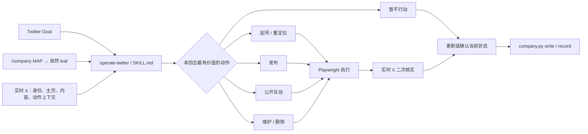

# Design — Agent Twitter 运营能力

## 1. 决策总览

| 决策 | 结论 | 原因 |
|---|---|---|
| Skill 边界 | 一个 `operate-twitter` 顶层 Skill，四个按需 playbook | Twitter 场景共享同一状态闭环；拆成多个 Skill 会重复规则并产生触发竞争 |
| 公司状态 | 只规定决策就绪信息，不规定 `/company` taxonomy、文件名或字段 | 保持 company-state 的自由生长契约，兼容不同公司 |
| 当前事实 | `/company` 管长期语义，实时 X 管当前账号事实；冲突时以 X 为准 | 新回合既需要历史连续性，也必须避免依据过期状态操作 |
| 决策方式 | 按公司目标、真实信号和学习价值判断，不设固定 cadence/分数/配额 | 避免 Agent 机械发帖或追逐 vanity metrics |
| 执行面 | 首期复用现有 Playwright/storage-state 浏览器 | 用户拒绝付费 X API，并知情接受网页脚本化风险 |
| CLI | 本任务只保留工具替换边界，不实现 CLI | 先用真实观测证明哪些页面流程值得封装 |
| 动作范围 | 起号/重定位、发布、公开互动、资料维护、置顶与删除；DM 后置 | 公共账号运营形成完整闭环，DM 有不同隐私和收件箱语义 |
| 权限 | Goal 授权后 Growth 直接执行，verifier 事后独立核查 | 沿用零人工公司治理，不新增逐帖审批 |
| 验收 | 使用当前真实账号；优先清理已有测试内容，临时改动同轮恢复 | 验证真实闭环而不长期污染账号 |

本任务保持单任务结构。CLI 与 DM 都已明确后置，不在当前任务下创建没有实施内容的子任务。

## 2. 交付边界

### 2.1 新增 Skill 目录

```text
agents/assets/skills/operate-twitter/
├── SKILL.md
└── references/
    ├── bootstrap-or-reposition.md
    ├── publish.md
    ├── engage.md
    └── maintain.md
```

- `SKILL.md` 是唯一触发入口，保持短小，只放每次必经的闭环与 reference 路由。
- 四个 reference 都由 `SKILL.md` 直接链接，避免深层引用和无关上下文加载。
- Skill 与 playbook 正文沿用仓库现有 Agent 资产语言（英语）；PRD、设计、实施计划和用户验收材料使用中文。
- 不增加 README、CHANGELOG、统一状态模板或 vendor 目录。

### 2.2 接线与契约文件

| 文件 | 变化 |
|---|---|
| `agents/growth.yaml` | 把 `assets/skills/operate-twitter` 加入 Growth baseline loadout，更新过时的 `use-accounts follow` 注释 |
| `agent/tests/test_resident_loadout.py` | 固定 Growth materialization 包含 `operate-twitter` 与四个 playbook |
| `agent/tests/test_operate_twitter_skill.py` | 固定 frontmatter、直接 reference 路由、核心闭环与首期范围锚点 |
| `.trellis/spec/backend/resident-agent-contracts.md` | 记录 Growth Twitter Skill、自由状态发现、实时 X 优先和现有浏览器复用契约 |

以下现有文件不修改：

- `agent/browser_mcp.sh`：登录、DISPLAY、proxy 三项独立降级已经满足需求；
- `agents/mcp/growth.json`：已提供 `playwright` server；
- `accounts/README.md`：已有 X storage-state 导出与失效重导说明；
- `agents/assets/growth-charter.md`：Twitter 能力由 Skill metadata 触发，本任务不顺手重写整个 Growth charter。

## 3. 核心数据流



### 3.1 必经闭环

`SKILL.md` 引导 Agent 按以下顺序工作：

1. **确认触发边界**：只有当前 Goal 确实要求 Twitter 运营才进入闭环；普通 heartbeat 不自行发起外部动作。
2. **恢复长期上下文**：运行 `company.py read`，按 MAP 与摘要渐进打开相关 topic/leaf，直到能回答 PRD 的五个决策就绪问题。
3. **读取实时自己**：打开 X，确认登录状态、当前 handle、公开资料、置顶内容和近期实际内容。若 `/company` 没有账号身份，允许先从实时账号和公司业务推断，再把有长期价值的结论写回自然状态。
4. **补最小实时上下文**：只读取本次判断依赖的 mentions、目标帖子、搜索、列表或账号，不扫描无关时间线。
5. **选择动作与 playbook**：按公司价值判断；可以组合多个 playbook，也可以选择不行动。
6. **执行前身份门**：每次外部写入前，再确认页面显示的当前账号与本次意图一致，并读取精确动作对象。
7. **执行与实时核实**：动作后重新打开 canonical 目标（自己的 profile、具体 post URL 或设置页面）确认结果，不能把点击成功当作业务成功。
8. **回写当前状态**：只更新值得跨回合保留的事实、判断、结果和待办，不追加浏览流水，也不为 verifier 制作专用 proof。
9. **结束记录**：按 company-state 契约执行 `company.py record`；没有状态变化时使用 `record --nothing`。

## 4. 状态契约

### 4.1 规定信息，不规定存储形状

Skill 只要求 Agent 在动作前恢复以下信息：账号身份、Twitter 在当前目标中的作用、最近相关动作/反馈、待处理信号/承诺、当前动作理由。它不规定这些信息必须共存于一个 leaf，也不提供复制粘贴模板。

正确发现方式：

```text
company.py read
→ 根据 MAP 摘要选择相关 topic
→ company.py read <topic> / company.py tree <topic>
→ 只读取判断需要的 leaf
```

错误方式：

- 假定 `/company/channels/x.md`、`growth/twitter.md` 等路径；
- 递归读取整个 `/company`；
- 为了满足 Skill 另建一份与现有产品/市场状态重复的 Twitter 总表；
- 把每次点击、滚动和页面文本追加成运行日志。

### 4.2 双源优先级

| 信息 | 权威来源 | 处理方式 |
|---|---|---|
| 公司是谁、产品与受众、当前目标、经验与待办 | `/company` | 跨回合保存，可自然拆分 |
| 当前登录账号、bio、头像、banner、链接、置顶、现存帖子/回复 | 实时 X | 每次 Goal 重新读取 |
| 具体帖子是否仍存在、回复上下文、动作是否成功 | 实时 X canonical URL | 写入前后都核实 |
| 值得长期保留的结果与下一步 | Agent 判断后写回 `/company` | 原地更新当前状态，不写 proof 日志 |

## 5. 浏览器工具边界与 token 策略

### 5.1 语义操作面

Skill 按语义描述以下操作，不暴露固定 CSS/XPath selector：

- `inspect-self`：确认登录身份、主页资料、置顶与近期内容；
- `inspect-context`：读取具体 post、conversation、mention、搜索或目标账号；
- `publish`：发布 post、Thread、reply 或 quote；
- `engage`：like、follow/unfollow 等公开动作；
- `maintain-profile`：修改资料与置顶；
- `delete-content`：精确删除已确认内容；
- `verify`：通过 canonical 页面确认最终状态。

首期这些语义全部映射到 Playwright。未来自有 CLI 只需提供同等语义，`/company` 契约和决策 playbook 无需改变。

### 5.2 浏览器使用原则

- 优先直接导航到 `x.com` 的目标 URL，而不是从首页多轮点击；
- 优先结构化页面快照、可访问性名称和语义 role；视觉资料、上传结果或页面布局判断才使用截图；
- 每轮只读取最小必要页面，先在快照中定位目标，再执行一次精确动作；
- X UI 变化时重新读取当前页面语义，不在 Skill 中保存 selector；
- 任何 mutation 后刷新或重开 canonical URL 验证；toast、按钮消失或一次 click 返回不能单独算成功；
- 如果 storage-state 失效而显示未登录，按现有账号轨报告登录态失效，不暗中改用 API或尝试不存在的凭证。

## 6. Playbook 设计

### 6.1 `bootstrap-or-reposition.md`

适用于空白账号、主页不完整、公司方向变化或实时账号与公司身份不一致。内容包括：

- 从公司产品、目标用户、客户语言与真实进展中形成账号承诺；
- 审计 display name、handle、bio、头像、banner、URL、位置、置顶与主页首屏内容的一致性；
- 按需组合 `mine-customer-voice`、`design-asset`、`gen-image`、`visual-iterate`；
- 修改后实时检查桌面主页展示，而不是只相信设置表单；
- 建立必要的首批内容，但不要求固定数量或永久 setup mode。

### 6.2 `publish.md`

适用于原创 post、Thread 或 quote。内容包括：

- 从真实产品进展、客户问题、可验证观点或已有资产中选材；
- 发布前检查自己的近期内容，避免重复与状态冲突；
- 按需调用 `de-ai-ify` 和视觉 Skills，不复制其方法；
- Thread 逐条保持上下文与顺序，发布后从 profile/conversation 验证完整性；
- 记录有学习价值的实际结果或待观察项，而非承诺无法保证的曝光。

### 6.3 `engage.md`

适用于公开 mentions、目标讨论、回复、quote、like 与 follow。内容包括：

- 先读完整帖子/对话与作者语境，再判断是否真能增加价值；
- 目标用户的具体问题、已有承诺与真实反馈优先于无关高曝光；
- reply 用于直接推进对话，quote 必须能独立增加上下文，like/follow 是有意义关系动作而非数字任务；
- 不设每日互动数、固定评分表或“每条都回复”；
- 不读取或发送 DM。

### 6.4 `maintain.md`

适用于资料调整、置顶/取消置顶、旧内容审计与删除。内容包括：

- 资料修改沿用起号时的身份一致性判断；
- 删除前打开精确 post/conversation，确认作者、文本、时间、URL 与理由；
- 对已有测试垃圾优先做真实清理；
- 删除后重开 URL/profile 验证对象消失；
- 临时测试变更在同一验收收尾中恢复，真实有价值变更明确保留。

## 7. Skill 组合与复用

`operate-twitter` 只负责编排，不重新教授其他原子能力：

| 需要 | 组合 Skill |
|---|---|
| 找到客户原话、目标讨论或 voice 依据 | `mine-customer-voice` |
| 清除公开文案 AI 味 | `de-ai-ify` |
| 制作头像、banner、社交卡片 | `design-asset` / `gen-image` |
| 视觉发布前检查和修订 | `visual-iterate` |
| 跨回合发现、写入和 record | `company-state` |

旧 `social-vendor-compare.md` 的方法类 catalog 不重新 vendor：通用 hook/post 公式不是当前缺口，且会重复现有能力。只复用已经落入 `mine-customer-voice` 的 listening 资料。

## 8. Loadout 与测试设计

### 8.1 声明式接线

`agents/growth.yaml` 是 role→skill 单一事实源。新增一条 skill 路径即可由 `resident_loadout` 递归复制整个目录；不改 Python materialization、MCP JSON、镜像或 compose。

### 8.2 确定性测试

1. `test_resident_loadout.py`：Growth skills 集合包含 `operate-twitter`，物化后主文件和四个 references 都存在。
2. `test_operate_twitter_skill.py`：
   - frontmatter 只有有效 `name` 与覆盖触发场景的 `description`；
   - `SKILL.md` 直接链接四个 playbook，所有本地 Markdown 引用可解析；
   - 核心闭环、自由状态发现、实时 X 优先、Goal 权限、DM/CLI 边界都有稳定语义锚点；
   - 不把固定 `/company` topic 当作所需路径。
3. 现有 `test_mcp_assets.py` 与 `test_browser_mcp.py` 保持绿色，证明本任务没有破坏浏览器接线与三项降级。

测试只固定结构性契约，不把运营判断翻译成 Python 打分，也不通过复制 Skill 原文制造 tautological test。

## 9. 真实账号 E2E

### 9.1 前置

- 任务已由用户审阅并 `task.py start`；
- 当前账号 storage-state 存在，Growth 浏览器打开 X 为登录态；
- 记录初始 handle、公开资料、置顶与候选测试内容，不读取或输出 cookies；
- 明确哪些现有内容是可删除测试垃圾，哪些真实内容不得因测试误删。

### 9.2 闭环

1. 用一次全新 Growth 上下文加载 `operate-twitter`，读取真实 `/company` 与实时 X。
2. 形成账号状态判断和一个与公司价值相符的动作选择。
3. 优先删除已有测试内容；若不足以覆盖发布→删除，则发布一条可识别的临时内容、实时验证、随后删除并再次验证。
4. 只有实时审计发现资料确需改善时，才做准备保留的资料变更；不为点按钮而改坏主页。
5. 使用 `company.py` 更新值得保留的当前状态并 record。
6. 用第二个全新上下文重新读取 `/company` 与 X，验证可以接续且不会重复刚才的动作。

### 9.3 证据与清理

- 开发验收证据写入当前 Trellis task 的 `research/e2e.md`；这是任务级测试记录，不是运行时 Skill 要求 Growth 给 verifier 喂 proof。
- 临时 post/reply/资料变更必须在本次验收结束前恢复，并从实时 X 二次确认。
- 删除是不可逆动作：只删除已实时确认且按 Goal 判断应清理的现有测试内容；在 e2e 记录中保存其 URL 与文本摘要，不假装可以回滚。
- 最终记录分开列出：保留的真实运营变化、已恢复的临时变化、已删除的旧测试垃圾。

## 10. 风险、兼容与回滚

| 风险 | 处理 |
|---|---|
| X 对非 API 自动化采取限制或封号 | 用户已知情接受；保留官方研究，不在 Skill 中反复重新争论或静默切换付费 API |
| X UI/文案变化 | 使用实时快照、语义 role 与结果验证，不硬编码 selector |
| 登录态失效 | 沿用现有 storage-state 失效/重导契约，明确报告，不改浏览器 wrapper |
| 多账号或错号 | 每次 mutation 前确认实时 handle 与公司身份/Goal 一致 |
| `/company` 结构不同 | 从 MAP 渐进发现，不保存固定路径 |
| 临时测试污染账号 | 同轮删除/恢复；结束前二次检查 profile 与相关 URL |
| 删除不可恢复 | 仅删除明确测试/错误内容；动作前保存任务级摘要并再次确认目标 |
| Skill 过长、token 增长 | 核心入口保持精简，场景细节放四个按需 reference；不 vendor 大型社媒方法库 |

代码回滚是纯声明式：从 `agents/growth.yaml` 移除 `operate-twitter`，删除新增 Skill 与测试，撤回 spec 小节。浏览器、cookies 与 `/company` 无需迁移。真实账号的临时变化必须在 E2E 当场恢复；已经按 Goal 删除的旧测试垃圾不做伪回滚。
