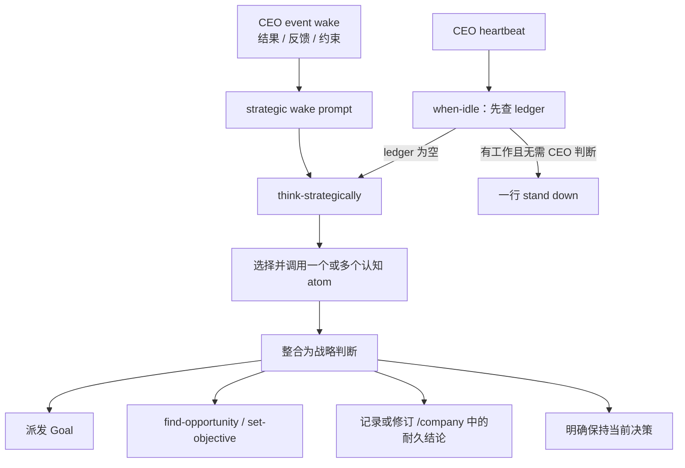

# 技术设计：CEO 持续战略思考循环

## 1. 设计结论

V1 由三层组成：

1. **确定性入口**：CEO 的每个事件 wake 在 inbox 前注入“先调用 `think-strategically`”；空 heartbeat 继续进入 `when-idle`，只有 ledger 为空时再调用 `think-strategically`。
2. **高自由度认知工具**：一个薄元 skill 负责选择四个单一职责的原子 skill，模型可以自由组合、重复和回退。
3. **现有决策与状态系统**：思考结论仍通过现有 Goal、`find-opportunity`、`set-objective` 和 `/company` 落地，不创建新的 verdict、状态库或角色。

这套结构只保证“CEO 会停下来思考，并有合适的思考方式可用”，不在 Harness 内尝试判定思考结论是否正确。

## 2. 系统边界



不进入本设计的边界：

- worker 与 verifier 的 wake 行为；
- Goal 验收、Hub、Objective verdict 和 `/company` 存储协议；
- 针对每种业务形态的完整经营工作流；
- 对思考内容进行运行时语义评分或重试。

## 3. 声明式战略模式

### 3.1 AgentSpec 字段

在 `agent/spec.py` 增加：

```python
strategic: bool = False
```

并将 `strategic` 加入 `_FIELDS`。它只控制 resident wake prompt 是否启用战略事件入口，不代表角色拥有通用管理权限，也不改变 one-shot runner。

`agents/ceo.yaml` 显式设置：

```yaml
strategic: true
```

其他角色不写该字段，默认 `False`。这样不需要在运行时代码中硬编码 `key == "ceo"`，也不会把 `idle=proactive` 与战略反思错误绑定成同一个概念。

### 3.2 never-brick 行为

`orchestration.agent_loop._role_config` 将 `strategic` 与现有 provider/model/effort/mcp/session/idle 一次性解析：

- `True`：开启；
- `False` 或字段缺失：关闭；
- 非 bool：打印 WARN 并降级为 `False`；
- YAML 缺失、损坏或无法加载：沿用现有整组默认值，并使 `strategic=False`。

boot log 增加 `strategic=true|false`，便于确认实际角色配置。降级方向必须是“不改变 prompt”，不能因错误配置让 worker 获得 CEO 指令。

## 4. Wake prompt 组合

### 4.1 接口

扩展纯函数：

```python
build_wake_prompt(
    events,
    objective=None,
    fresh=False,
    idle="stop",
    strategic=False,
)
```

`agent_loop(...)` 同样接收 `strategic=False`，`main()` 从 `_role_config` 传入。

### 4.2 事件 wake

当且仅当 `events` 非空且 `strategic=True` 时，在事件正文前加入固定前缀，语义为：

> 在处理这些消息和采取行动前，先调用 `think-strategically`；把新信息放回现有公司逻辑中，判断它改变了什么，再决定下一步。

最终顺序保持：

```text
ORIENT_PREFIX（仅 fresh role）
→ standing objective（如存在）
→ strategic event prefix（仅 strategic role 的事件 wake）
→ inbox event body
```

Objective 仍在最上层作为方向锚点；战略指令紧贴消息之前，避免被 inbox 内容淹没。前缀必须以字母开头，保持 CLI prompt 不得以 `-` 开头的契约。

### 4.3 heartbeat

`strategic=True` 本身不修改空事件分支。heartbeat 仍由 `idle` 决定：

- worker `idle=stop`：现有固定文本 byte-identical；
- CEO `idle=proactive`：固定要求调用 `when-idle`；
- `when-idle` 查到 ledger 为空后，skill 内再调用 `think-strategically`；
- ledger 有工作且没有判断需求时，不为“强制思考”额外烧一轮 token。

这避免 heartbeat 同时收到两套入口，也保留“先便宜查 ledger”的现有优化。

### 4.4 为什么不用 Stop hook

现有 Hook 适合检查可确定的操作，例如是否调用 `company.py record`。战略思考没有可靠 marker：

- 检查是否出现 skill 名只能证明打了勾；
- 解析 transcript 判断因果质量会引入脆弱的第二个 LLM/规则系统；
- Stop 时才阻断过晚，容易诱导模型补一段形式化反思。

因此 V1 用确定性的 wake prompt 触发，不增加 blocking hook、重试或 marker。如果真实运行显示模型经常忽略明确指令，再基于该失败单独设计更强 enforcement。

## 5. Skill 架构

### 5.1 分层

```text
think-strategically                ← 元认知入口
├── trace-causal-chain             ← 推导与找断点
├── challenge-thesis               ← 攻击当前结论
├── reason-as-buyer                ← 买家侧推演
└── integrate-new-information      ← 合并 delta 与追踪影响

find-opportunity / set-objective   ← 思考后按需进入的决策 workflow
send-goal / when-idle              ← 执行与调度 workflow
```

元 skill 不包含四个 atom 的完整正文，也不把现有 workflow 包进去。它只完成路由、组合和整合，避免形成一个巨大、每次都全量执行的 checklist。

### 5.2 `think-strategically`

触发条件写入 description：CEO 事件 wake 的行动前，以及空 ledger 的 heartbeat。正文原则：

- 先读取本次判断真正相关的 `/company` 内容，不全量扫库；
- 说清本次需要解决的战略问题，而不是直接选 action；
- 至少选择一个适合的认知 atom，可以串联、重复或换 atom；
- 综合 facts / assumptions / unknowns 后才作决定；
- 结论可能保持、修改或推翻当前方向；Objective 改动仍走 `set-objective`；
- 将会改变未来决策的结论写回 `/company` 的自然主题位置；不创建反思日志。

禁止项：固定调用顺序、固定数量、统一表格、分数、PASS/FAIL、要求每次推翻 Objective。

### 5.3 原子 skill 合同

| Skill | 输入关注点 | 产出关注点 | 明确不做 |
| --- | --- | --- | --- |
| `trace-causal-chain` | 一个商业判断、已知事实、公司可执行动作 | 从事实到销售结果的推导、负载假设、断点和反向反馈 | 不规定统一漏斗，不裁决 Objective |
| `challenge-thesis` | 当前倾向或已接受结论 | 最强反例、替代解释、隐含假设、失败路径 | 不为了显得批判而强制反对 |
| `reason-as-buyer` | 具体买家、处境、offer 与替代品 | 发现、理解、信任、相信、选择和付款的真实摩擦 | 不把角色扮演当证据，不代替用户研究 |
| `integrate-new-information` | 新事实/反馈/结果与既有认知 | 精确 delta、受影响的下游结论、保持/修改/重做判断 | 不每次从零规划，不因变化小而跳过 |

Skill 正文使用开放式推理提示和少量反例，不要求机械字段。每个目录的行为来源仍是 `SKILL.md`；若初始化工具生成 `agents/openai.yaml`，它只提供 UI 元数据，不能承载独立业务规则。

### 5.4 与销售和产品效果的关系

`trace-causal-chain` 与 `reason-as-buyer` 以付款为商业终点，但不把链条粗暴缩成“有人有需求 → 会买”：

- 如果真实效果是买家相信、评价、口碑、复购或转介绍的必要条件，就必须进入推理；
- 如果某业务可以在交付前通过可信证据获得一次性销售，也不额外要求先证明最终用户结果；
- 关键是解释每个结论如何作用于销售，而不是预设所有 business form 的同一成功路径。

## 6. CEO charter 调整

`agents/assets/ceo-charter.md` 做概念级修改，不复制 skill 正文：

1. 开头把 CEO 定义为战略制定者：先 THINK，形成方向和判断，再 DISPATCH。
2. 删除“每次 wake 保持短促”对重要决策的错误约束，改为投入与判断相称的思考，同时避免空转。
3. 新增持续反思原则：新信息到来时判断其相对现有认知的 delta 和下游影响。
4. 澄清 DONE：不重新验收完成质量，但要重新判断结果对战略意味着什么。
5. 保持 `/company` 为所有耐久事实、推理和决策的唯一位置。
6. Objective 只能经 `set-objective` 修改、CEO 不亲自执行 worker 工作等边界不变。

## 7. `when-idle` 调整

保留 Step 1 的 ledger 命令和忙碌分支。重写 coasting 分支：

1. ledger 为空不是休息许可；
2. 先调用 `think-strategically`，判断公司当前最值得想清楚或推进的事情；
3. 根据判断派发 Goal、进入 opportunity/objective workflow，或记录一个会改变后续工作的战略结论；
4. 不得仅复述 Objective、重复旧等待理由后停止。

删除：

- “唯一合法结束是 dispatch”；
- 必然生成 Goal 的固定 ladder；
- “等待任何一件事时必须找 side quest”的绝对规则。

保留：

- 不因“等数据”直接睡眠；
- CEO 不亲自做 worker 工作或外部写入；
- 多 Goal 不能用来填充忙碌感。

V1 不新增对“战略结论是否足够有价值”的结构校验。

## 8. 现有 workflow 的兼容修改

### `find-opportunity`

只调整 business form 段落：

- Agent 能力适配是选择形态的先验；
- 先选一个可探索的 form 仍然可以降低搜索空间；
- 选择不是锁定，研究发现用户、渠道或购买行为与该形态不匹配时应改 form；
- opportunity 与 form 共同形成，不能把任一方当成完全独立变量。

候选仍需真实信号，仍产生 2–3 个不同方向并交给 `set-objective`；不把 `think-strategically` 嵌入其中，避免递归调用。

### `set-objective`

保留全部提案、Verifier、revision 和 verdict 机制。只澄清：

- PASS 是基于当前证据允许最小真实 delivery；
- PASS 不是永久真理，新事实可让 CEO 重新反思；
- 普通 Goal 完成不自动重开 Objective，但若其结果改变负载前提，CEO 可以正式进入 revision；
- `PASS → BUILD` 不变，BUILD 不等于只写代码，也不等于停止思考。

## 9. `/company` 数据行为

本任务没有 schema 或路径迁移：

- Skill 使用 `company.py read/tree` 渐进读取；
- 重要结论按现有主题归属更新相应 Markdown leaf；
- 不创建固定的 `strategy/reflections.md`、`beliefs.json` 或每-wake 日志；
- 临时推演可以只存在于当前推理中，只有丢失后会影响未来决策的内容才写回；
- 现有 company-state contract 与 Stop record hook 不变。

## 10. 测试设计

### 10.1 纯函数与配置回归

- `AgentSpec`：`strategic` 默认 false、CEO true、builder false。
- `_role_config`：true 透传；非法类型 WARN + false；缺 YAML/坏 YAML 仍返回完整默认 tuple。
- 事件 prompt：`strategic=True` 时前缀位于 Objective 后、inbox 前；`strategic=False` byte-identical。
- heartbeat：`strategic` 不改变空事件文本；CEO proactive 文本仍调用 `when-idle`，但不再硬编码“派发后才能停”。
- loop/main：配置能传到每次 `build_wake_prompt`，boot log 可见。
- fresh/objective/leading-dash 组合继续通过。

### 10.2 角色与 skill 合同

- CEO 精确 loadout 新增五个 skill；所有部门精确集合不变。
- 五个 skill 的目录和 `SKILL.md` 均可 materialize。
- skill catalog 测试锁定 description 中的关键触发语，避免模型无法发现。
- 使用 skill-creator 的 `quick_validate.py` 验证 frontmatter、命名和基本结构。

### 10.3 文本契约

静态检查确保现行文件不再同时宣称：

- CEO event wake 无需战略思考；
- coasting heartbeat 唯一合法结局是派发；
- business form 可以随便选且与需求无关；
- Objective PASS 后不必再反思。

归档任务和 thirdtest 业务记录是历史证据，不回写。

### 10.4 Forward test

在不接入 live `/company`、不允许外部写入的隔离环境中，将以下原始材料交给一个 fresh-context CEO：

- 已批准的 NCLEX Objective 相关片段；
- KDP hard blocker 结果；
- 自建商店失去 Amazon 分发机制的片段；
- 初始流量/销售观测。

提示只要求“处理这次新结果”，不告诉模型应放弃、换形态或得出“没有市场”。保存原始 prompt、实际 skill 调用和完整输出，人工观察：

- 是否先进入 meta skill；
- 选择了哪些 atom，是否只是机械全调用；
- 是否明确说出新信息改变的旧假设和下游影响；
- 是否把渠道替换误当成局部实现细节；
- 是否能合理保持、修改或推翻，而不是被期待答案牵引。

这些是观察维度，不汇总成分数，也不据一次结果定义新的通用门槛。若未调用 skill 或 prompt 未接线，属于实现缺陷；思考深度不足则记录为后续收紧依据。

## 11. Spec 同步

- `.trellis/spec/backend/resident-agent-contracts.md`：新增 `strategic` 声明、事件 prompt 行为，更新 proactive idle 的 coasting 语义。
- `.trellis/spec/backend/agent-handbook-contracts.md`：澄清 DONE 不重验收，但 CEO 仍要整合其战略含义。
- `.trellis/spec/backend/agent-execution-contracts.md` 仅在其 AgentSpec 字段说明需要保持完整时补充；不改 runtime adapter 协议。
- `.trellis/spec/backend/company-state-contracts.md` 行为不变，无需为了本任务重复改写。

## 12. 兼容、发布与回滚

- 所有新参数默认关闭；未更新的调用者和所有 worker prompt 不变。
- 不迁移 `/company`、Objective、ledger、inbox 或 session。
- 本任务不修改 thirdtest 业务状态，也不自动重启 live resident。实际部署若另行授权，只需让 CEO resident 重新加载代码与 loadout；worker 无需因本功能重启。
- 回滚时同时删除 CEO 的五个 skill 声明、`strategic` 配置和 prompt 接线，并恢复 charter/when-idle/find/set 文本；没有状态迁移需要逆转。
