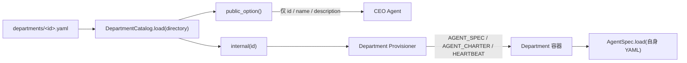

# 技术设计：合并 Department Catalog 与 AgentSpec

## 1. 问题与设计目标

当前系统用两层 YAML 描述一个固定 Department：

```text
catalog.yaml 条目
  ├─ 公开名称/描述
  ├─ AgentSpec 路径
  ├─ charter、Skills、MCP、heartbeat
  └─ 指向 departments/<id>.yaml

departments/<id>.yaml
  └─ provider、model、charter、Skills、MCP、权限与运行模式
```

这两个对象始终 1:1。`skills`、`mcp_config` 已经出现无消费者的重复声明，charter 也存在两条
可能漂移的路径。目标结构是：

```text
departments/<id>.yaml（唯一事实来源）
  ├─ public_name / public_description / heartbeat_secs
  └─ provider / model / system_prompt / skills / mcp_config / ...

DepartmentCatalog（代码中的固定集合与公开投影）
  └─ 按固定 ID 加载四个 YAML
```

文件合并不改变 Hub 对 Agent 的信息投影。内部完整模板只在确定性控制面使用，CEO 仍只收到公开
字段。

## 2. 目标 YAML 契约

以 Builder 为例：

```yaml
name: builder
public_name: Build Department
public_description: 把已选择的方向转化为可运行、可交付、可验证的产品与技术资产。
heartbeat_secs: 900
provider: codex
model: gpt-5.6-sol
effort: xhigh
credentials: subscription
system_prompt: ../assets/departments/builder-charter.md
skills:
  - ../assets/skills/company-state
mcp_config: ../mcp/builder.json
permission_mode: bypass
session: fresh
idle: proactive
strategic: false
```

`public_*` 和 `heartbeat_secs` 是 Department 专用元数据。Agent runtime 对未知字段保持现有的
前向兼容行为；控制面加载器负责读取和校验这些 Department 元数据。这样无需把 Department 专用
字段扩散成所有 CEO/Worker/Verifier 都必须理解的通用 AgentSpec 属性。

## 3. DepartmentCatalog 加载边界

保留 `DepartmentCatalog` 名称及其 `options()`、`internal()` API，避免把集合、顺序、白名单和公开
投影逻辑散落到 Controller 与 Provisioner。

`DepartmentCatalog.load(departments_dir)` 的目标行为：

1. 固定允许 ID 仍为 `strategist / researcher / builder / growth`。
2. 检查目录中 YAML 文件集合与四个 `<id>.yaml` 完全一致。
3. 按 `ALLOWED_IDS` 顺序逐个读取 YAML，校验根节点为 mapping。
4. 校验 `name == id == 文件 stem`。
5. 校验 `public_name`、`public_description` 为非空字符串。
6. 校验 `heartbeat_secs` 为正整数；四个内置文件显式声明 `900`，不依靠隐式缺省。
7. 校验 `system_prompt` 是非空相对路径，并将其相对 Department YAML 目录归一化为
   `agents/` 挂载根下的 charter 路径；路径不得逃出 `agents/`。
8. 确定性生成容器内 AgentSpec 路径 `departments/<id>.yaml`。

`DepartmentTemplate` 只保留控制面真正消费的字段：

```text
id / public_name / public_description / agent_spec / charter / heartbeat_secs
```

删除 `skills`、`mcp_config`，因为 Skills 与 MCP 的唯一消费者应从 AgentSpec 读取。

## 4. 数据流与公开投影



安全和权限边界保持在 Hub：

- `list_department_options` 与 `create_department` 仍只注册给 CEO actor；
- `public_option()` 仍构造新字典，只选取三个公开字段；
- `create_department` 只接受 `option_id` 与 `initial_objective`；
- 完整 YAML 是否同文件存储，不改变 API 投影。

## 5. 调用方迁移

- `CompanyHub` 默认从 `agents/departments/` 加载，并把内部参数从 catalog 文件语义调整为
  Department specs 目录语义。
- `DepartmentProvisioner` 从相同目录加载，确保 Hub 与 Provisioner 使用同一组声明。
- 测试中的 `CATALOG` 常量和直接路径调用改为 Department specs 目录。
- 不保留读取旧 `catalog.yaml` 的兼容分支；这是仓库内静态配置重构，没有外部数据格式或已存储
  company state 需要兼容。

## 6. 兼容性与风险

### 路径归一化

AgentSpec 中的 `system_prompt` 相对 `agents/departments/<id>.yaml`。Provisioner 需要的是相对
容器挂载根 `/opt/foundagent-orch/agents/` 的路径。加载时必须归一化为
`assets/departments/<id>-charter.md`，并拒绝逃出 `agents/` 的路径。

### 固定目录完整性

不能简单 `glob` 后接受任意文件，否则新增一个 YAML 就会绕过固定四类的产品约束。目录集合必须
与 `ALLOWED_IDS` 精确相等，顺序仍由 `ALLOWED_IDS` 决定。

### 双消费者一致性

Hub/Provisioner 读取 Department 元数据，Agent runtime 读取 AgentSpec 字段。两者读取同一文件但
关注不同字段；测试必须证明路径推导和启动参数与 Agent runtime 实际使用的配置一致。

### 回滚

本改造不迁移持久状态。若回滚，只需恢复 `catalog.yaml`、旧加载器和旧路径引用；既有
`state/<company>/` 数据无需变化。

## 7. 取舍

- 不删除 `DepartmentCatalog` 类：需要一个单点维护固定 ID、顺序、校验和公开投影。
- 不让目录扫描自动注册新 Department：固定四类是现有产品契约。
- 不为旧 catalog 增加兼容读取：兼容层会继续保留两套 schema，违背单一事实来源目标。
- 不在本任务收紧容器挂载：当前边界是合作型 Agent 与 Hub 方法授权，文件系统硬隔离属于独立
  安全设计。
