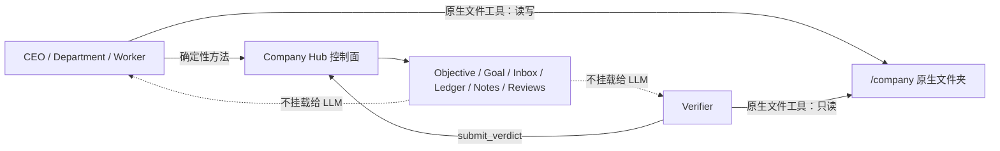

# 技术设计：原生 Company 文件夹

## 1. 设计结论

`/company` 继续承担持久共享 Company State，但不再拥有独立的 Python 存储协议。文件系统本身成为知识面的唯一数据接口：Agent 通过 runtime 已有的文件工具进行浅层浏览、限定搜索、按需读取和直接维护；Skill 负责教授行为规范。

控制面保持确定性。Objective、Goal、Inbox、Ledger、Notes、review、权限和生命周期仍由 Company Hub 管理，不能因为知识面改用原生文件而泄露到 Agent runtime。

## 2. 不变量与边界

### 2.1 保留的不变量

- `/company` 是唯一直接可浏览的公司数据树。
- CEO、Department、Worker 对 `/company` 读写；Verifier 只读。
- Worker 的完成证据必须是持久化在 `/company` 下的 leaf；`submit_result` 只提交摘要和绝对 leaf 引用。
- Verifier 必须检查实际 leaf，不能只相信 Worker 摘要。
- 内部编排目录绝不挂载给 Agent；逻辑方法继续做身份、权限、状态转换和幂等控制。

### 2.2 删除的不变量

- 根目录必须存在 `MAP.md`。
- 每个非根目录必须存在 `OVERVIEW.md`。
- 导航 front matter 必须镜像磁盘子项。
- 所有 Company 文件读写必须经过 `company.py`。
- Company 写入必须持有 `.company.lock`。
- 非 Markdown 资产必须先经过 CLI descriptor 才能打开。

取消这些不变量后，磁盘目录是唯一结构事实，不再存在需要同步的第二份导航真相。

## 3. Agent 原生访问契约

### 3.1 发现与读取

Skill 使用与 runtime 无关的行为描述，并给出原生工具示例：

1. 从 `/company` 根目录列出直接子项或最多一到两层路径。
2. 根据目录名和文件名选择与当前任务相关的区域。
3. 在相关区域内做限定范围的文件名或正文搜索。
4. 只读取足以支持当前判断的少量 leaf。
5. 已知 verifier 引用时直接打开精确路径，不重新扫描整个 Company。

禁止 `ls -R`、无界 `find`、对所有文本执行整库输出，或为了“了解情况”批量读取全部正文。渐进式披露是 Agent 的访问策略，不是存储格式。

### 3.2 写入与维护

Agent 在写入前先查看目标目录并搜索同一主题：

- 有权威现有文档时原地更新；
- 没有合适位置时创建表达业务含义的新路径；
- 文件名描述内容，不描述执行它的 Agent 或本次 wake；
- 不创建会话完成标记、读取日志或无业务变化的空记录；
- 移动、重命名和删除前先确认引用、事实与验收证据不会丢失；
- 二进制资产直接使用适合的 image、PDF、browser 或其他查看工具打开。

Skill 不规定全局 taxonomy，也不要求 README、MAP 或 OVERVIEW。目录复杂后是否创建普通说明文档由 Agent 根据真实需要决定。

### 3.3 冷启动

`make shared` 已经创建空的 `state/<company>/company/`。新契约下，空目录无需初始化文件；Agent 第一次产生持久业务变化时直接创建自然的主题目录和 leaf。

## 4. 代码删除与替换面

### 4.1 删除

- 删除整个 `company_state_kit/`，包括 CLI、包入口和专属测试。
- 从 `docker-compose.yml` 删除 CEO runtime 的两个 toolkit 只读挂载。
- 从 `orchestration/department_provisioner.py`、`worker_manager.py` 删除动态 runtime 的 toolkit 挂载。
- 删除仅由旧 CLI 消费的 `COMPANY_ROOT` 环境变量，包括 CEO、Department、Worker 和 Verifier 的启动与 turn 环境。

### 4.2 改写 Agent-facing 契约

- 重写 `agents/assets/skills/company-state/SKILL.md` 为原生读写契约。
- 重写 `company-state-readonly/SKILL.md` 为原生只读、精确 leaf 优先的验证契约。
- 修改 `orchestration/agent_loop.py` 的 COMPANY ENTRY，不再要求从 `MAP.md` 开始。
- 修改 `operate-twitter/SKILL.md` 中的发现和持久化步骤，使其复用新的 `company-state` 契约。
- 其他只说“通过 company-state Skill 访问 `/company`”且未硬编码旧 CLI 的 Skill 保持不变。

### 4.3 文档与规范

- 重写 `.trellis/spec/backend/company-state-contracts.md`，记录新的原生文件夹真实契约。
- 更新 `.trellis/spec/backend/index.md` 和 `three-layer-agent-company-contracts.md` 中的旧 read/tree/write 描述。
- 更新 `README.md` 的架构表和测试命令，删除不存在的记忆层包与测试路径。

## 5. 测试设计

- 删除 `company_state_kit/tests/`，不保留 CLI 或迁移兼容测试。
- 更新 wake prompt 测试：断言存在 `/company` 原生入口和渐进读取提示，断言不再出现 `/company/MAP.md`。
- 更新 `operate-twitter` 静态契约测试：固定原生 Company 发现和直接持久化要求，拒绝旧 CLI 文案。
- 扩展固定/动态 runtime mount 测试：继续固定 `/company` 的 RW/RO 权限，并断言不存在 `/opt/company_state_kit` 或对应宿主目录挂载。
- Compose 解析测试继续固定 CEO 的 `/company` 挂载和内部目录隔离。
- 仓库级搜索作为删除门禁，排除 Trellis 历史任务后，不允许有效产品代码、Skill、Prompt、README、当前规范或测试保留旧协议关键词。

原生文件读写本身由 Agent runtime 和操作系统提供，本任务不重新实现一套 Python 文件 I/O 测试替代已经删除的 CLI 测试。

## 6. 兼容、运行数据与回退

- `state/` 被 Git 忽略；实现不修改、清理或迁移其中任何运行数据，也不新增依赖现有数据形态的兼容分支。
- 已有 `MAP.md`、`OVERVIEW.md` 和 `.company.lock` 不迁移、不清理；在新契约下它们只是普通现有文件，不享有特殊语义。
- 已有业务 Markdown、代码、图片、PDF 和其他资产继续原位可读。
- 代码回退使用 Git revert 或恢复删除提交；由于本任务不迁移运行数据，不存在数据 schema 回滚步骤。

## 7. 风险与控制

| 风险 | 控制方式 |
|---|---|
| Agent 递归读取导致上下文膨胀 | Skill 明确浅层列举、限定搜索、少量 leaf，并由静态测试固定关键约束 |
| 文件名不足以表达内容 | 要求描述性命名；确有需要时允许普通说明文档自然出现，但不预设全局索引 |
| 重复文档和并行真相 | 写前目录检查与主题搜索；优先更新现有权威文档 |
| 原生删除或重组误伤证据 | Skill 要求先确认引用、事实与验收承载，再进行移动、重命名或删除 |
| 多 Agent 同时写同一 leaf | 本任务不新增锁或合并协议；旧 CLI 也无法约束绕过它的原生写入，真实冲突出现后再依据证据设计机制 |
| specialized Skill 继续教授旧入口 | repo-wide 搜索与专属静态测试共同拦截 |
| 删除旧代码后难以回退 | 单次聚焦提交和 Git 历史恢复；不修改运行数据 |

## 8. 不采用的方案

- **保留 CLI 作为可选兼容层**：用户明确选择删除，避免主代码路径同时存在两套 Company 访问方式。
- **保留自动 MAP/OVERVIEW**：当前没有证据表明文件系统与描述性命名不足；这会继续制造第二份结构真相。
- **同步迁移现有 state**：运行数据不受 Git 管理且用户明确不需要迁移，清理会增加不必要的破坏风险。
- **本次新增实验遥测**：先观察现有 telemetry、日志与目录结果，等待真实失败模式后再定义指标。
